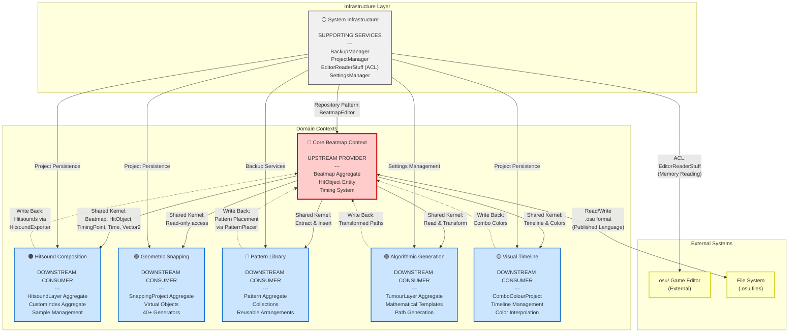

# Mapping Tools - Bounded Contexts

This document defines the proposed Bounded Contexts for DDD migration, synthesizing findings from ubiquitous language and domain model analyses.

## Executive Summary

The Mapping Tools codebase contains **7 distinct Bounded Contexts** with clear boundaries based on:
1. **Semantic conflicts** (polysemes identified in ubiquitous language analysis)
2. **Data ownership patterns** (aggregates and their lifecycles)
3. **Cohesive responsibilities** (related functionality grouping)
4. **Team/user mental models** (how mappers think about the domain)

---

## Bounded Context Catalog

### 1. 🔴 Core Beatmap Context

**Purpose**: Manage the complete beatmap file format and its core gameplay elements

**Responsibilities**:
- Parse and serialize `.osu` beatmap files
- Manage hit objects (circles, sliders, spinners, hold notes)
- Handle timing system (redlines, greenlines, BPM calculations)
- Maintain combo colors and metadata
- Enforce beatmap-level invariants (sorting, timing consistency)
- Provide beatmap validation and consistency checking

**Ubiquitous Language**:
- **Beatmap**: Complete .osu file representation
- **HitObject**: Gameplay element (Circle/Slider/Spinner/HoldNote)
- **TimingPoint**: Control point (Redline=BPM, Greenline=modifier)
- **Timing**: Complete timing system with binary search
- **Combo**: Color grouping of hit objects
- **Metadata**: Song/map information
- **Slider**: Curved hit object with path
- **SliderPath**: Geometric curve representation
- **Resnap**: Realign objects to timing grid

**Core Aggregates**:
- [`Beatmap`](../../Mapping_Tools/Classes/BeatmapHelper/Beatmap.cs) (Root)
  - Contains: HitObjects, Timing, Storyboard, ComboColours, Metadata
- `HitObject` (Entity within Beatmap)
- `Timing` (Value Object within Beatmap)
- `TimingPoint` (Value Object)

**Key Files/Modules**:
- `Mapping_Tools/Classes/BeatmapHelper/Beatmap.cs`
- `Mapping_Tools/Classes/BeatmapHelper/HitObject.cs`
- `Mapping_Tools/Classes/BeatmapHelper/Timing.cs`
- `Mapping_Tools/Classes/BeatmapHelper/TimingPoint.cs`
- `Mapping_Tools/Classes/BeatmapHelper/ComboColour.cs`
- `Mapping_Tools/Classes/BeatmapHelper/BeatmapEditor.cs`
- `Mapping_Tools/Classes/BeatmapHelper/FileFormatHelper.cs`
- `Mapping_Tools/Classes/BeatmapHelper/SliderPathStuff/`

**Relationships**:
- **Upstream to**: All other contexts (provides Beatmap as shared kernel)
- **Downstream from**: None (core domain)
- **Integration**: Read/write via `BeatmapEditor` repository

**Source of Truth**: `.osu` files on disk + osu! editor memory (merged)

---

### 2. 🟠 Hitsound Composition Context

**Purpose**: Create and manage complex hitsound arrangements using layers and samples

**Responsibilities**:
- Layer-based hitsound composition
- Import hitsounds from multiple sources (MIDI, beatmaps, storyboards)
- Sample generation and manipulation (volume, pitch, panning)
- Custom index optimization for efficient sample usage
- Export hitsounds to beatmaps in various formats
- Audio processing and synthesis

**Ubiquitous Language** (Context-Specific):
- **Layer**: Single hitsound sound and all times it plays (NOT storyboard/tumour/snapping layer)
- **Sample**: In-memory audio representation with generating args (NOT SampleSet enum or file)
- **Package**: Group of samples playing simultaneously
- **CustomIndex**: osu! custom sample index (1-99) for efficient sample reuse
- **Zone**: Time region with specific hitsound rules
- **Schema**: Template for sample generation parameters
- **ImportArgs**: Source information for layer reloading
- **SampleGeneratingArgs**: How to generate/synthesize a sample

**Core Aggregates**:
- [`HitsoundLayer`](../../Mapping_Tools/Classes/HitsoundStuff/HitsoundLayer.cs) (Root)
  - Contains: Times list, SampleGeneratingArgs, ImportArgs
- [`CustomIndex`](../../Mapping_Tools/Classes/HitsoundStuff/CustomIndex.cs) (Root)
  - Contains: Index number, Sample definitions per SampleSet/Hitsound
- `SamplePackage` (Value Object - transient)
- `HitsoundProject` (Implicit aggregate - collection of all layers)

**Key Files/Modules**:
- `Mapping_Tools/Classes/HitsoundStuff/HitsoundLayer.cs`
- `Mapping_Tools/Classes/HitsoundStuff/Sample.cs`
- `Mapping_Tools/Classes/HitsoundStuff/CustomIndex.cs`
- `Mapping_Tools/Classes/HitsoundStuff/HitsoundConverter.cs`
- `Mapping_Tools/Classes/HitsoundStuff/HitsoundExporter.cs`
- `Mapping_Tools/Classes/HitsoundStuff/HitsoundImporter.cs`
- `Mapping_Tools/Classes/HitsoundStuff/SampleSchema.cs`
- `Mapping_Tools/Viewmodels/HitsoundStudioVm.cs`
- `Mapping_Tools/Views/HitsoundStudio/`

**Relationships**:
- **Upstream from**: Core Beatmap Context (reads hit objects, writes hitsounds back)
- **Downstream to**: None
- **Integration**: 
  - Anti-Corruption Layer: `HitsoundConverter` translates between contexts
  - Import from beatmaps via `HitsoundImporter`
  - Export to beatmaps via `HitsoundExporter`

**Source of Truth**: Hitsound project JSON files (user workspace)

**Context Boundary Notes**:
- "Layer" means something completely different here vs Storyboard/Snapping/Tumour contexts
- "Sample" is context-specific (NOT the same as file or SampleSet)
- Must translate at boundary when interacting with Core Beatmap Context

---

### 3. 🟢 Geometric Snapping Context

**Purpose**: Generate virtual geometric objects for precise hit object placement

**Responsibilities**:
- Generate virtual objects (points, lines, circles, curves)
- 40+ geometric generators (intersections, parallels, perpendiculars, bisectors, etc.)
- Real-time overlay rendering in osu! client
- Layered object generation (inception-based)
- Coordinate conversion between osu! and screen space
- Relevancy scoring and filtering
- Project-based configuration persistence

**Ubiquitous Language** (Context-Specific):
- **Generator**: Geometric algorithm creating virtual objects (NOT sample/tumour/rhythm generator)
- **RelevantObject**: Virtual geometric object for snapping (point/line/circle)
- **Layer**: Generated object collection at specific inception level (NOT hitsound/storyboard/tumour)
- **Inception**: Recursion depth of layered generation
- **Relevancy**: Score determining object importance/visibility
- **Overlay**: In-game visualization of virtual objects
- **SaveSlot**: Saved generator configuration with hotkey

**Core Aggregates**:
- [`SnappingToolsProject`](../../Mapping_Tools/Classes/Tools/SnappingTools/Serialization/SnappingToolsProject.cs) (Root)
  - Contains: Preferences, SaveSlots, Generators list
- `RelevantObjectLayer` (Value Object - transient, not persisted)
- `RelevantObjectsGenerator` (40+ concrete types)

**Key Files/Modules**:
- `Mapping_Tools/Classes/Tools/SnappingTools/`
- `Mapping_Tools/Classes/Tools/SnappingTools/DataStructure/RelevantObjectGenerators/`
- `Mapping_Tools/Classes/Tools/SnappingTools/DataStructure/RelevantObjects/`
- `Mapping_Tools/Classes/Tools/SnappingTools/Serialization/`
- `Mapping_Tools/Viewmodels/SnappingToolsVm.cs`
- `Mapping_Tools/Views/SnappingTools/`

**Relationships**:
- **Upstream from**: Core Beatmap Context (reads current hit objects for context)
- **Downstream to**: None
- **Integration**:
  - Read-only access to beatmap via `BeatmapEditor`
  - No direct beatmap modification (user places objects manually)
  - Overlay rendered via `Overlay.NET` library

**Source of Truth**: Snapping project JSON files

**Context Boundary Notes**:
- "Layer" and "Generator" have specific meanings here
- Virtual objects never directly become hit objects (user manually places)
- Transient computational geometry - no persistence of generated objects

---

### 4. 🔵 Pattern Library Context

**Purpose**: Store and reuse mapping patterns across beatmaps

**Responsibilities**:
- Extract patterns from beatmaps (selected hit objects + timing)
- Store patterns in organized collections
- Transform patterns (scale, rotate, retime)
- Place patterns into target beatmaps
- Maintain pattern metadata (name, parts, usage)
- Handle cross-BPM pattern adaptation

**Ubiquitous Language**:
- **Pattern**: Reusable arrangement of hit objects with timing
- **Collection**: Organized group of related patterns
- **Part**: Section of pattern (e.g., "Verse", "Chorus")
- **Placement**: Inserting pattern into beatmap at specific time
- **Extraction**: Creating pattern from beatmap selection
- **Relative Timing**: Pattern timing independent of absolute time

**Core Aggregates**:
- `Pattern` (Implicit - file-based aggregate)
  - Contains: Subset of hit objects, timing points, metadata
- `PatternCollection` (Implicit - folder-based)

**Key Files/Modules**:
- `Mapping_Tools/Classes/Tools/PatternGallery/`
- `Mapping_Tools/Viewmodels/PatternGalleryVm.cs`
- `Mapping_Tools/Views/PatternGallery/`

**Relationships**:
- **Upstream from**: Core Beatmap Context (extracts from and inserts into beatmaps)
- **Downstream to**: None
- **Integration**:
  - `OsuPatternMaker` extracts patterns from beatmaps
  - `OsuPatternPlacer` inserts patterns into beatmaps
  - Transactional: Remove conflicts → Transform → Insert → Recalculate

**Source of Truth**: Pattern files on disk (`.osu` format)

**Context Boundary Notes**:
- Patterns are self-contained beatmap subsets
- Must transform timing when placing across different BPMs
- Pattern "parts" allow selective insertion

---

### 5. 🟣 Algorithmic Pattern Generation Context

**Purpose**: Generate complex patterns using mathematical algorithms

**Responsibilities**:
- Generate patterns from mathematical templates (circle, parabola, square, triangle)
- Layer-based pattern configuration
- Property-based customization (offset, rotation, length, width)
- Slider path manipulation and generation
- Apply generated patterns to selected sliders

**Ubiquitous Language** (Context-Specific):
- **Template**: Mathematical shape generator (Circle/Parabola/Square/Triangle)
- **Layer**: Pattern generation configuration (NOT hitsound/storyboard/snapping)
- **Property**: Customizable parameter (offset, rotation, scale)
- **Relative**: Property relative to base object
- **Absolute**: Property in absolute coordinates
- **Tumour**: Algorithm-generated pattern overlay

**Core Aggregates**:
- [`TumourLayer`](../../Mapping_Tools/Classes/Tools/TumourGenerating/Options/TumourLayer.cs) (Root)
  - Contains: Template, Properties, Enabled state
- `ITumourTemplate` (Strategy pattern - 4+ implementations)

**Key Files/Modules**:
- `Mapping_Tools/Classes/Tools/TumourGenerating/`
- `Mapping_Tools/Classes/Tools/TumourGenerating/Options/`
- `Mapping_Tools/Viewmodels/TumourGeneratorVm.cs`
- `Mapping_Tools/Views/TumourGenerator/`

**Relationships**:
- **Upstream from**: Core Beatmap Context (reads sliders, writes transformed paths)
- **Downstream to**: None
- **Integration**:
  - Reads base slider path from beatmap
  - Applies algorithmic transformations
  - Writes modified path back to beatmap

**Source of Truth**: Tool configuration (UI state, not persisted as project)

**Context Boundary Notes**:
- "Layer" means generation configuration (different from other contexts)
- Purely algorithmic - no user pattern library
- Templates are mathematical formulas, not reusable content

---

### 6. 🟡 Visual Timeline Context

**Purpose**: Manage time-based visual properties (combo colors, storyboard effects)

**Responsibilities**:
- Timeline-based combo color management
- Color interpolation and gradients
- ColourPoint management (time-based color changes)
- Mode selection (sequence/gradient/interpolation)
- Visual preview of color timeline
- Export color changes to beatmap

**Ubiquitous Language**:
- **ColourPoint**: Timeline marker with color assignment
- **ComboColour**: osu! combo color (max 8)
- **Timeline**: Visual representation of color changes over time
- **Mode**: Color application method (sequence/gradient/interpolation)
- **Interpolation**: Smooth color transition between points

**Core Aggregates**:
- [`ComboColourProject`](../../Mapping_Tools/Classes/Tools/ComboColourStudio/ComboColourProject.cs) (Root)
  - Contains: ColourPoints list, ComboColours list, Mode settings

**Key Files/Modules**:
- `Mapping_Tools/Classes/Tools/ComboColourStudio/`
- `Mapping_Tools/Viewmodels/ComboColourStudioVm.cs`
- `Mapping_Tools/Views/ComboColourStudio/`

**Relationships**:
- **Upstream from**: Core Beatmap Context (reads timeline, writes colors)
- **Downstream to**: None
- **Integration**:
  - Reads hit object timeline from beatmap
  - Exports color assignments to beatmap
  - Project-based persistence

**Source of Truth**: Combo colour project JSON files

**Context Boundary Notes**:
- Focused on visual/aesthetic properties only
- Timeline concept specific to visual domain
- Could expand to include other visual effects (storyboard integration)

---

### 7. ⚪ System Infrastructure Context

**Purpose**: Provide cross-cutting technical services and application infrastructure

**Responsibilities**:
- Application configuration and settings
- Automatic backup management
- Project serialization/deserialization
- osu! editor memory reading and integration
- Update management
- File system operations
- Global event coordination (ListenerManager)
- Error handling and logging

**Ubiquitous Language**:
- **Manager**: System-level service (Settings/Backup/Project/Listener)
- **Backup**: Timestamped copy of beatmap before modification
- **Project**: Serialized tool configuration state
- **EditorReader**: Memory reading from osu! client
- **Listener**: Event subscription for editor state changes
- **Settings**: Global application configuration

**Key Components** (Not aggregates - infrastructure services):
- [`SettingsManager`](../../Mapping_Tools/Classes/SystemTools/SettingsManager.cs)
- [`BackupManager`](../../Mapping_Tools/Classes/SystemTools/BackupManager.cs)
- [`ProjectManager`](../../Mapping_Tools/Classes/SystemTools/ProjectManager.cs)
- [`ListenerManager`](../../Mapping_Tools/Classes/SystemTools/ListenerManager.cs)
- [`EditorReaderStuff`](../../Mapping_Tools/Classes/ToolHelpers/EditorReaderStuff.cs)
- [`UpdateManager`](../../Mapping_Tools/Updater/UpdateManager.cs)

**Key Files/Modules**:
- `Mapping_Tools/Classes/SystemTools/`
- `Mapping_Tools/Classes/ToolHelpers/EditorReaderStuff.cs`
- `Mapping_Tools/Updater/`
- `Mapping_Tools/App.xaml.cs`
- `Mapping_Tools/MainWindow.xaml.cs`

**Relationships**:
- **Supports**: All domain contexts (infrastructure layer)
- **Integration**: 
  - Anti-Corruption Layer for osu! editor (`EditorReaderStuff`)
  - Repository pattern (`BeatmapEditor`, `ProjectManager`)
  - Backup before every domain operation

**Source of Truth**: 
- Settings: `config.json`
- Backups: Timestamped `.osu` files
- Editor state: osu! process memory

**Context Boundary Notes**:
- Not a domain context - purely technical infrastructure
- Provides shared services to all domain contexts
- No business logic - only technical operations

---

## Context Map Summary

### Upstream/Downstream Relationships

**Core Beatmap Context** (Upstream)
- ↓ Provides beatmap data to ALL other domain contexts
- ↓ Shared kernel: Beatmap, HitObject, TimingPoint, Time, Vector2

**Hitsound Composition Context** (Downstream)
- ↑ Consumes beatmap for import
- ↓ Produces hitsounds back to beatmap

**Geometric Snapping Context** (Downstream)
- ↑ Reads beatmap hit objects (read-only)
- No writes back to beatmap (user places manually)

**Pattern Library Context** (Downstream)
- ↑ Extracts patterns from beatmap
- ↓ Inserts patterns back into beatmap

**Algorithmic Pattern Generation Context** (Downstream)
- ↑ Reads slider paths from beatmap
- ↓ Writes transformed paths back

**Visual Timeline Context** (Downstream)
- ↑ Reads hit object timeline from beatmap
- ↓ Writes color assignments back

**System Infrastructure Context** (Supporting)
- → Provides services to ALL contexts
- Anti-corruption layer for external integration

### Integration Patterns

**1. Conformist** (Most tool contexts ↔ Core Beatmap)
- Tools conform to Core Beatmap's model
- Read/write via `BeatmapEditor` repository
- No translation needed for basic operations

**2. Anti-Corruption Layer**
- `EditorReaderStuff`: Protects from osu! editor memory format
- `HitsoundConverter`: Translates between Hitsound and Beatmap domains

**3. Shared Kernel**
- Core value objects: `Time`, `Vector2`, `SampleSet`, `Hitsound`, `GameMode`
- Core entities (read-only): `Beatmap`, `HitObject`, `TimingPoint`

**4. Open Host Service**
- Core Beatmap Context provides `BeatmapEditor` as service
- All tools access via standardized interface

**5. Published Language**
- `.osu` file format is the published language
- All contexts must serialize/deserialize to this format

---

## Semantic Conflict Resolution

### Critical Polyseme: "Layer"

**Problem**: "Layer" has 4 completely different meanings across contexts

**Resolution Strategy**:
1. **Hitsound Context**: Keep "HitsoundLayer" (well-established)
2. **Snapping Context**: Consider "SnappingLayer" or "VirtualObjectLayer"
3. **Tumour Context**: Consider "TumourConfiguration" or "GenerationLayer"
4. **Storyboard Context**: Keep "StoryboardLayer" (standard osu! term)

**At Boundaries**: Always qualify: "hitsound layer", "snapping layer", etc.

### Medium Priority: "Sample"

**Problem**: 3 different meanings (object, file, enum)

**Resolution Strategy**:
1. **Hitsound Context**: "Sample" = hitsound sample object (context-specific)
2. **Core Beatmap Context**: "SampleSet" enum (standard osu! term)
3. **File System**: "Sample file" or "audio file" (explicit qualification)

**At Boundaries**: Translate based on context

### Medium Priority: "Generator"

**Problem**: Multiple generator types across contexts

**Resolution Strategy**:
1. **Snapping Context**: "Generator" = geometric generator (context-specific)
2. **Hitsound Context**: "SampleGenerator" (explicit)
3. **Tumour Context**: "PatternGenerator" or "TumourGenerator" (explicit)
4. **Rhythm Context**: "RhythmAnalyzer" (different term)

**At Boundaries**: Use qualified names

---

## Context Interaction Examples

### Example 1: Hitsound Studio Export

```
1. User creates HitsoundLayers in Hitsound Context
2. HitsoundConverter (ACL) translates to SamplePackages
3. Optimization: CustomIndices generated
4. HitsoundExporter writes to Core Beatmap Context:
   - Creates hit objects with hitsound flags
   - Assigns custom indices
   - Exports sample files
5. BeatmapEditor persists to .osu file
6. BackupManager (Infrastructure) ensures safety
```

**Context Boundary**: HitsoundConverter acts as Anti-Corruption Layer

### Example 2: Pattern Placement

```
1. User selects pattern in Pattern Library Context
2. PatternPlacer loads pattern (mini-beatmap)
3. Target beatmap loaded from Core Beatmap Context
4. Transaction begins:
   a. Remove conflicting objects in time range
   b. Transform pattern timing for target BPM
   c. Insert pattern objects
   d. Recalculate timing references
5. BeatmapEditor saves modified beatmap
```

**Context Boundary**: Pattern extraction/placement crosses contexts transactionally

### Example 3: Snapping Tools Usage

```
1. SnappingToolsProject loaded (Snapping Context)
2. Generators configured by user
3. EditorReader (Infrastructure) monitors osu! editor
4. When beatmap changes detected:
   a. Read current hit objects (Core Beatmap Context)
   b. Generate virtual objects (Snapping Context)
   c. Render overlay (Infrastructure)
5. User manually places hit objects in osu! editor
6. No automatic beatmap modification
```

**Context Boundary**: Read-only access to beatmap, no write-back

---

## Migration Recommendations

### Phase 1: Formalize Current Boundaries (Low Risk)

**Actions**:
1. Add explicit bounded context folder structure
2. Document ubiquitous language per context
3. Create context README files
4. Identify and mark anti-corruption layers
5. Standardize repository interfaces

**Impact**: Minimal code changes, improved documentation

### Phase 2: Clarify Hitsound Context (Medium Risk)

**Actions**:
1. Introduce `HitsoundProject` aggregate (collection of layers)
2. Make `SamplePackage` immutable
3. Separate converter logic from domain logic
4. Add domain events for layer changes
5. Formalize import/export boundaries

**Impact**: Refactoring within Hitsound domain

### Phase 3: Extract Infrastructure Services (Medium Risk)

**Actions**:
1. Create proper repository interfaces
2. Separate domain logic from persistence
3. Introduce Unit of Work for transactions
4. Add domain event infrastructure
5. Formalize ACL for editor integration

**Impact**: Cleaner separation of concerns

### Phase 4: Add Domain Events (High Value)

**Actions**:
1. BeatmapModified event
2. HitsoundLayerChanged event
3. PatternPlaced event
4. Enable undo/redo via event sourcing
5. Better cross-context coordination

**Impact**: Improved extensibility and testability

---

## Shared Kernel Definition

### Core Value Objects (Immutable)

**Shared Across ALL Contexts**:
- `Vector2` - 2D position
- `Time` (double) - Milliseconds
- `Color` / `ComboColour` - Color values

**Shared Across Domain Contexts**:
- `SampleSet` enum (Normal/Soft/Drum)
- `Hitsound` enum (N/W/F/C flags)
- `GameMode` enum (Std/Taiko/Catch/Mania)
- `PathType` enum (Linear/Bezier/etc.)

### Core Entities (Read-Only Outside Owner)

**Owned by Core Beatmap Context, Shared Read-Only**:
- `Beatmap` - Complete beatmap structure
- `HitObject` - Individual gameplay objects
- `TimingPoint` - Timing control points

**Access Pattern**: Other contexts read via repository, never modify directly

---

## Future Context Candidates

### Potential New Contexts

**1. Storyboard Context**
- **Current**: Embedded in Core Beatmap Context
- **Reasoning**: Different lifecycle, visual vs gameplay
- **Language**: Layer, Sprite, Animation, Command, Easing
- **Migration**: Extract from Beatmap aggregate

**2. Timing Analysis Context**
- **Current**: Split across Timing Helper and Core
- **Reasoning**: Specialized algorithms (BPM detection, resnapping)
- **Language**: BPM, Meter, Measure, TempoChange, Resnap
- **Migration**: Extract timing intelligence from Core

**3. Metadata Management Context**
- **Current**: Tool + part of Core Beatmap
- **Reasoning**: Cross-beatmap operations, different rules
- **Language**: Mapset, Difficulty, Metadata, Tags, Source
- **Migration**: Already partially separate (MetadataManager tool)

---

## Validation Checklist

### Is This a Valid Bounded Context?

For each context, verify:

✅ **Has its own Ubiquitous Language** (terms mean specific things here)
✅ **Clear responsibilities and boundaries** (what it owns vs what it uses)
✅ **Identifiable aggregates** (at least one aggregate root)
✅ **Consistent model** (no internal contradictions)
✅ **Team/user mental model alignment** (how users think about it)
✅ **Integration points defined** (how it communicates with other contexts)
✅ **Source of truth identified** (where data persists)

### Context Health Indicators

**Healthy Context**:
- Clear aggregate boundaries
- Strong invariants enforced
- Minimal coupling to other contexts
- Well-defined integration patterns
- Consistent ubiquitous language

**Needs Attention**:
- Unclear aggregate boundaries (Hitsound Context)
- Tight coupling between contexts
- Shared mutable state
- Leaky abstractions
- Polyseme confusion at boundaries

---

**Document Version**: 1.0  
**Analysis Date**: 2025-11-17  
**Contexts Identified**: 7 (6 domain + 1 infrastructure)  
**Next Step**: Generate Context Map visualization (Task 4)

---

## Context Map Visualization

The following Mermaid diagram visualizes the relationships between all Bounded Contexts, showing upstream/downstream dependencies and integration patterns.



### Diagram Legend

**Node Types**:
- 🔴 **Core Beatmap Context**: Upstream provider (red) - all other contexts depend on it
- 🟠🟢🔵🟣🟡 **Domain Contexts**: Downstream consumers (blue) - depend on Core Beatmap
- ⚪ **Infrastructure Context**: Supporting services (gray) - provides technical services
- **External Systems**: Yellow nodes - systems outside application boundary

**Relationship Types**:
- **Solid arrows (→)**: Upstream provides to downstream (data flow, dependency)
- **Dotted arrows (-.->)**: Downstream writes back to upstream (optional feedback)
- **Bidirectional (↔)**: Two-way integration (file system persistence)

**Integration Patterns Shown**:
1. **Shared Kernel**: Core Beatmap provides common value objects and entities
2. **Open Host Service**: BeatmapEditor repository accessed by all domain contexts
3. **Anti-Corruption Layer (ACL)**: EditorReaderStuff protects from osu! editor format
4. **Published Language**: `.osu` file format as standard exchange format
5. **Conformist**: Tool contexts conform to Core Beatmap's model

### Context Relationships Summary

| From Context | To Context | Pattern | Description |
|--------------|------------|---------|-------------|
| Core Beatmap | All Domain Contexts | **Shared Kernel** | Provides Beatmap, HitObject, TimingPoint, Time, Vector2 |
| Infrastructure | All Contexts | **Supporting Service** | Provides BackupManager, ProjectManager, Settings |
| Infrastructure | osu! Editor | **Anti-Corruption Layer** | EditorReaderStuff translates memory format |
| Hitsound | Core Beatmap | **Conformist + ACL** | HitsoundConverter translates between domains |
| Snapping | Core Beatmap | **Conformist (Read-Only)** | No write-back, user places objects manually |
| Pattern | Core Beatmap | **Conformist** | Transactional extract and insert operations |
| Tumour | Core Beatmap | **Conformist** | Reads paths, transforms, writes back |
| Visual | Core Beatmap | **Conformist** | Reads timeline, writes colors |
| Core Beatmap | File System | **Published Language** | `.osu` format serialization |

### Key Observations from Visualization

1. **Star Pattern**: Core Beatmap Context is the central hub - all domain contexts depend on it
2. **Read-Heavy**: Most contexts read from Core Beatmap, fewer write back
3. **Infrastructure Omnipresence**: System Infrastructure supports all contexts equally
4. **Clean Boundaries**: No direct dependencies between domain contexts (all go through Core)
5. **External Integration**: Only one ACL needed (EditorReaderStuff for osu! editor)
6. **Unidirectional Data Flow**: Clear upstream → downstream pattern (no circular dependencies)

### Migration Impact Analysis

**High Impact Changes** (affect multiple contexts):
- Modifying Core Beatmap Context structure → Ripple effect to all 6 domain contexts
- Changing `.osu` file format → Affects persistence and external integration
- Refactoring Infrastructure services → Impacts all contexts

**Low Impact Changes** (isolated to single context):
- Hitsound layer management → Only Hitsound Context
- Snapping generator algorithms → Only Snapping Context
- Pattern transformation logic → Only Pattern Context

**Anti-Corruption Layers** (protect from external changes):
- EditorReaderStuff → Isolates osu! editor memory format changes
- HitsoundConverter → Isolates Hitsound ↔ Beatmap translation

---

**Visualization Version**: 1.0  
**Diagram Type**: Context Map with Integration Patterns  
**Contexts Visualized**: 7 bounded contexts + 2 external systems  
**Last Updated**: 2025-11-17