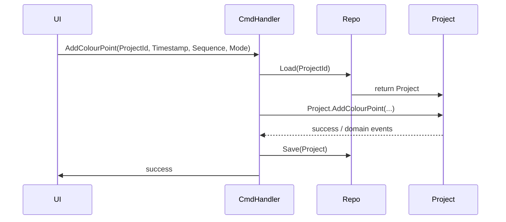
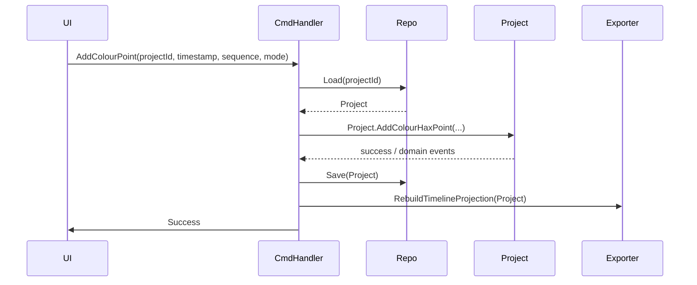
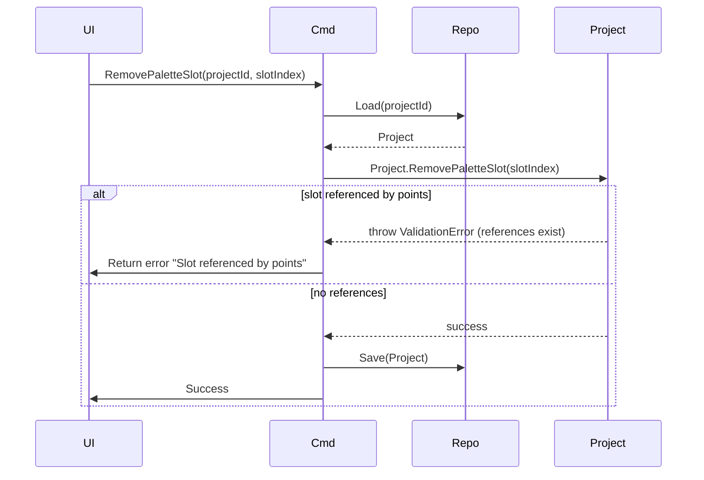
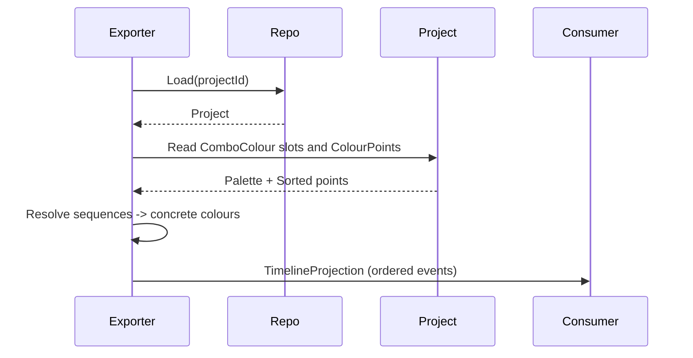

# ColourHax Studio — Domain Design (DDD)

Purpose

ColourHax Studio is a domain for designing and applying timed, ordered colour sequences to rhythm-game beatmaps and timelines. The document defines the business capabilities, entities, aggregates, bounded context and integration points without referencing implementation details.

Goals

- Provide a clear, testable domain model for creating and editing colour sequences tied to moments in time.
- Support deterministic ordering and grouping of colours per timestamp.
- Support fixed-size palettes, palette management and palette references from time points.
- Enable persistence and export of projects and integration with external timeline/beatmap contexts.

Ubiquitous Language

- Project: A persisted work unit containing palettes and timed colour points.
- Colour Palette (Palette): An ordered collection of named palette slots containing colours; has a current size and a maximum size.
- Palette Slot: A single position inside a Palette that references a Colour.
- Combo Colour (Colour): The colour value used in palettes and references.
- Colour Point (Point): A timestamped entry that references a sequence of Palette Slot indexes and a Mode.
- Sequence: The ordered list of palette slot indexes attached to a Colour Point.
- Mode: The behaviour of a Colour Point (e.g., Normal, Burst).
- Burst: A mode where a Colour Point represents a multi-hit group; may have a MaxBurstLength constraint.

Business Capabilities (High level)

- Create and manage Projects.
- Manage Palettes: add/remove slots, set colours, enforce size limits.
- Manage Colour Points: create, update, delete timestamped sequences.
- Associate Palette slots with Colour Points by index.
- Persist and retrieve Projects (single write owner).
- Export projections for UI and for external systems (read projections).

Bounded Context and Context Map (C4 - high level)

- ColourHax Studio (bounded context): owns the modelling of palettes, points and project persistence.
- Beatmap / Timeline (external context): provides timing information and is a consumer of exported projections.
- UI / Editor (client): issues commands and displays read projections.

mermaid C4 context diagram:

```mermaid
graph LR
  User[User / Editor]
  subgraph CHS [ColourHax Studio (bounded context)]
    UI[UI / Editor]
    Domain[Domain & Exporter]
  end
  Beatmap[Beatmap / Timeline]
  Storage[Project Storage]

  User -->|Interacts| UI
  UI -->|Commands| Domain
  Domain -->|Exports timeline projections| Beatmap
  Domain -->|Persist / Load Project| Storage
```

Core Aggregates and Entities (business-first)

- Project (Aggregate Root)
  - Identity: ProjectId
  - Responsibilities: own lifecycle of palettes and colour points; enforce invariants across the project.
  - Contains: Palette (as a collection/value-object), Colour Points (entities sorted by time).

- Palette (Owned Entity / Collection)
  - Fixed maximum capacity and current size.
  - Provides operations: add slot, remove slot, set colour at slot.
  - Invariant: size >= 1 and size <= maxSize.

- Colour Point (Entity)
  - Identity: Timestamp (domain-unique within the project).
  - Contains: Sequence (ordered list of palette indexes), Mode.
  - Invariant: sequence indexes are within current palette size.
  - Ordering: points are ordered by timestamp; timestamps are comparable and form the primary ordering.

- Combo Colour (Value Object)
  - Immutable colour value used in palette slots.

Important Business Rules and Invariants

- Palette size must never be less than 1.
- Palette size cannot exceed MaxSize.
- Colour Point timestamps must be unique within a project; a Colour Point is identified by its timestamp.
- A Colour Point's sequence may reference palette slot indexes; references must be validated whenever palette size changes.
- Removing palette slots should update or reject colour points that reference removed slot indexes (policy decision documented below).

Policies for palette-slot removal (two alternatives)

1) Strict: Prevent removal if any point references the slot (fail operation). Ensures referential integrity but reduces flexibility.
2) Migration: Allow removal and migrate affected points by remapping indexes or removing references. Prefer when UX must allow dynamic palette editing.

Data Ownership and Repositories

- The Project Aggregate is the authoritative write model for palettes and points. It is the single source of truth for updates that change palette size, colour values or points.
- Persistence is implemented behind a ProjectRepository interface; the repository is responsible for loading and saving a whole Project aggregate (atomic write).
- Read projections are derived from the Project for UI and export; they are eventually consistent snapshots used by the editor.

Commands, Use Cases and Transactions

- CreateProject(CreateCommand) -> Project created with default palette.
- AddPaletteSlot(ProjectId) -> updates size; may return failure if at MaxSize.
- RemovePaletteSlot(ProjectId, SlotIndex) -> enforce policy (strict or migrate).
- SetPaletteColour(ProjectId, SlotIndex, Colour) -> updates slot value.
- AddColourPoint(ProjectId, Timestamp, Sequence, Mode) -> create point, verify sequence indexes valid.
- UpdateColourPoint(ProjectId, Timestamp, NewSequence, NewMode) -> replace point (timestamp identity).
- RemoveColourPoint(ProjectId, Timestamp) -> delete point.

Transaction boundaries:

- Commands modifying Project should be handled in a transaction that loads the aggregate, applies changes and persists the whole aggregate.

Domain Events (examples)

- ProjectCreated
- PaletteSlotAdded
- PaletteSlotRemoved
- PaletteColourSet
- ColourPointAdded
- ColourPointUpdated
- ColourPointRemoved

Read Models and Projections

- ProjectSummary (id, palette size, number of points, time span) for listing projects.
- TimelineProjection (ordered list of points with resolved colour values) for UI playback and export.
- PaletteProjection (current slots with colours) for palette UI.

Consistency and Concurrency

- Use optimistic concurrency at repository level (version on aggregate) to prevent lost updates.
- When concurrent palette-size modifications conflict with points referencing slots, define resolution policy (reject or auto-migrate).

ER Diagram (persistence conceptual model)

ER diagram removed — persistence model is described in the "Persistence Models" section below (use the Class Diagram and normalized table list for implementation guidance).

Component decomposition (Container / Component view)

- API / Command Handler: Receives commands from UI, invokes domain operations on Project aggregate.
- ProjectRepository: atomic load/save of Project aggregate.
- Exporter: produces TimelineProjection and file formats.
- Validation component: enforces invariants before applying changes.

Example sequence (AddColourPoint)



Testing and BDD

- Express domain rules as BDD scenarios (examples below). Tests focus on aggregate behaviours and invariants, not infrastructure.
- Example BDD scenario: Given a project with palette size 2, When AddColourPoint with sequence referencing index 2, Then operation fails.

BDD scenarios (illustrative)

- Create project with default palette.
- Add palette slots until reaching MaxSize; adding beyond returns failure.
- Remove last palette slot when multiple slots exist; removal is blocked when only one slot remains or as policy dictates.
- Add colour point at timestamp T with valid sequence; project contains point and timeline projection resolves colours.

Migration and Data Evolution

- Persist aggregate version and schema version. Provide migration paths: when palette max size changes, or when sequence storage format upgrades.

Operational concerns

- Exported timeline must be deterministic; order and timestamps preserved.
- Large projects: prefer streaming projections for export instead of loading entire in memory when projecting for export.

Next steps (implementation-phase tasks)

- Choose slot-removal policy (Strict vs Migration).
- Define repository persistence format (single-file aggregate vs normalized tables).
- Define API/Message contracts for UI and exporters.
- Implement optimistic concurrency versioning.

Appendix: Mapping to project artefacts (optional)

This design is intentionally implementation-agnostic. When proceeding to implementation map the aggregates and repositories to modules and tests, using the domain tests approach (BDD) to verify invariants.
## Bounded Contexts and Context Map (detailed)

Contexts
- ColourHax Studio (core bounded context): owns modelling, rules and persistence for projects, palettes and colour points. Maps to the aggregate root [`Mapping_Tools.Domain/ColourHaxStudio/ColourHaxProject.cs`](Mapping_Tools.Domain/ColourHaxStudio/ColourHaxProject.cs:8) and entities like [`Mapping_Tools.Domain/ColourHaxStudio/ColourHaxPoint.cs`](Mapping_Tools.Domain/ColourHaxStudio/ColourHaxPoint.cs:6).  
- Beatmap/Timeline (external context): supplies timing information and consumes exported timeline projections.  
- UI / Editor (client context): issues commands and displays read projections.  
- Persistence / Storage (infrastructure context): implements the repository contract [`Mapping_Tools.Domain/ColourHaxStudio/IColourHaxProjectRepository.cs`](Mapping_Tools.Domain/ColourHaxStudio/IColourHaxProjectRepository.cs:3).

```mermaid
graph LR
  User[User / Editor]
  CHS[ColourHax Studio (bounded context)]
  Beatmap[Beatmap / Timeline]
  Storage[Project Storage]

  User -->|Commands / UI actions| CHS
  CHS -->|Exports timeline projections| Beatmap
  CHS -->|Load / Save Project| Storage
```

C3 (Component) view inside the ColourHax Studio bounded context
- Command Handlers / Application Service: receive UI intent, load Project aggregate and apply changes.
- Project Aggregate: [`Mapping_Tools.Domain/ColourHaxStudio/ColourHaxProject.cs`](Mapping_Tools.Domain/ColourHaxStudio/ColourHaxProject.cs:8) — authoritative writer.
- Palette Component: [`Mapping_Tools.Domain/ColourHaxStudio/ColourPalette.cs`](Mapping_Tools.Domain/ColourHaxStudio/ColourPalette.cs:8) — manages slots and size invariants.
- Colour Point Component: [`Mapping_Tools.Domain/ColourHaxStudio/ColourHaxPoint.cs`](Mapping_Tools.Domain/ColourHaxStudio/ColourHaxPoint.cs:6) — timestamp identity and sequence.
- Repository: implements [`Mapping_Tools.Domain/ColourHaxStudio/IColourHaxProjectRepository.cs`](Mapping_Tools.Domain/ColourHaxStudio/IColourHaxProjectRepository.cs:3).
- Exporter / Projection Builder: resolves slot indexes to concrete colour values (uses `ComboColour` entries).

```mermaid
graph TD
  UI[UI / Editor]
  Cmd[Command Handlers]
  Repo[Project Repository]
  Project[Project Aggregate\n(ColourHaxProject)]
  Palette[Palette Component]
  Point[Colour Point Component]
  Exporter[Exporter / Projection Builder]
  Beatmap[Beatmap / Timeline]

  UI --> Cmd
  Cmd --> Repo
  Repo --> Project
  Project --> Palette
  Project --> Point
  Cmd --> Exporter
  Exporter --> Beatmap
```

ER-level persistence conceptual model (normalized)
Removed ER diagram block — persistence tables are listed textually in the "Persistence Models" section above; prefer the Class Diagram for domain design and the normalized table list for storage mapping.

Sequence diagram: AddColourPoint (happy path)


Policy decision: palette-slot removal
- Two options considered:
  - Strict (recommended default): reject RemoveSlot when any Colour Point references the slot. Simplifies correctness and preserves referential integrity.
  - Migration (opt-in): allow removal and automatically remap or prune sequence entries; requires clear UX guarantees and complex domain logic.
- Recommendation: adopt Strict by default, provide a Migration service for explicit, user-driven remapping operations.

Validation & invariants summary
- Palette.Size ∈ [1, MaxSize]. (see [`Mapping_Tools.Domain/ColourHaxStudio/ColourPalette.cs`](Mapping_Tools.Domain/ColourHaxStudio/ColourPalette.cs:33))
- ColourPoint timestamp is the point identity and must be unique within a project (SortedSet semantics on [`Mapping_Tools.Domain/ColourHaxStudio/ColourHaxPoint.cs`](Mapping_Tools.Domain/ColourHaxStudio/ColourHaxPoint.cs:105)).
- Sequences must reference valid slot indexes; repository/command handlers must validate before Save.
- Project aggregate owns all mutations to palettes and points (single-write model).

Next actions (design-phase)
- Finalize component responsibilities (C3) and map to code modules.
- Specify repository persistence shape (file-per-project vs normalized DB).
- Produce acceptance BDD scenarios for RemoveSlot policy and timestamp uniqueness.
- Draft read-model contracts for TimelineProjection and PaletteProjection.

## Aggregates, Entities, Value Objects and Aggregate Rules

Aggregate boundaries (business view)
- Project (Aggregate Root) — authoritative write-owner for palettes and points. Maps to [`ColourHaxProject`](Mapping_Tools.Domain/ColourHaxStudio/ColourHaxProject.cs:8). All modifications that affect palette size, palette contents or colour points must be expressed as commands against this aggregate and persisted atomically.
- Palette — owned by the Project aggregate; modeled by [`ColourPalette`](Mapping_Tools.Domain/ColourHaxStudio/ColourPalette.cs:8). Treated as part of Project's internal state (no independent repository).
- Colour Point — entity inside Project identified by timestamp; modeled by [`ColourHaxPoint`](Mapping_Tools.Domain/ColourHaxStudio/ColourHaxPoint.cs:6). Points are ordered by Time and therefore naturally deduplicated/unique within the Project aggregate.
- Combo Colour — domain value for a palette slot. Currently represented by [`ComboColour`](Mapping_Tools.Domain/ColourHaxStudio/ComboColour.cs:8) but note the earlier namespace/shape mismatch; resolve so tests and domain share the same value definition.
- Repository contract — Project persistence interface: [`IColourHaxProjectRepository`](Mapping_Tools.Domain/ColourHaxStudio/IColourHaxProjectRepository.cs:3). Repository loads and saves the entire Project aggregate.

Aggregate invariants and rules (must be enforced by Project)
- Palette Size Invariant
  - 1 <= Palette.Size <= Palette.MaxSize  
  - Enforced on palette creation and on operations AddSlot / RemoveSlot. See [`ColourPalette` constructor and methods](Mapping_Tools.Domain/ColourHaxStudio/ColourPalette.cs:33).
- Unique Timestamp Identity
  - Each Colour Point's Time is the domain identifier; no two points with equal Time may exist in the same Project (SortedSet semantics on [`ColourHaxPoint`](Mapping_Tools.Domain/ColourHaxStudio/ColourHaxPoint.cs:105)). Project must reject or merge duplicate-time commands.
- Sequence Referential Integrity
  - Every slot index in a Colour Point.Sequence must be < Palette.Size. If a palette change would leave references invalid, the Project must either block the change (Strict policy) or apply an explicit migration operation (Migration policy).
- Burst Length Constraint
  - Project exposes `MaxBurstLength` (see [`ColourHaxProject.MaxBurstLength`](Mapping_Tools.Domain/ColourHaxStudio/ColourHaxProject.cs:18)). When Mode == Burst, the sequence length must be validated against `MaxBurstLength` at command time.

Transaction and consistency boundaries
- Single aggregate transaction: load Project via repository, apply command (mutate aggregate in-memory), validate invariants, persist aggregate. Use optimistic concurrency/versioning on repository to prevent lost updates.
- Cross-context integration: exports and timeline projections are read-only and derived from Project; they may be rebuilt asynchronously after Project changes.

Command & Domain Event catalogue (names only, expressive)
- Commands (intent)
  - CreateProject
  - AddPaletteSlot
  - RemovePaletteSlot (subject to chosen policy)
  - SetPaletteColour(projectId, slotIndex, colour)
  - AddColourPoint(projectId, timestamp, sequence, mode)
  - UpdateColourPoint(projectId, timestamp, newSequence, newMode)
  - RemoveColourPoint(projectId, timestamp)
  - MigratePaletteReferences(projectId, slotIndex, migrationMap) — explicit migration operation
- Domain Events (published by aggregate)
  - ProjectCreated
  - PaletteSlotAdded
  - PaletteSlotRemoved
  - PaletteColourSet
  - ColourPointAdded
  - ColourPointUpdated
  - ColourPointRemoved
  - PaletteReferencesMigrated

Read models (projections)
- ProjectSummary: id, palette size, #points, time span (for lists).
- PaletteProjection: ordered slot list with resolved ComboColour values for UI palette.
- TimelineProjection: ordered list of resolved events for playback/export — each point with absolute Time, Mode and resolved colours (map slot indexes → colour values).
- These projections are rebuilt from the Project aggregate and can be stored separately for efficient UI reads.

Acceptance BDD scenarios (core)
- Scenario: Add palette slot increases size
  - Given a Project with Palette.Size = N and N < MaxSize  
  - When AddPaletteSlot is executed  
  - Then Palette.Size = N + 1 and PaletteSlotAdded event is published
- Scenario: Prevent slot removal with active references (Strict policy)
  - Given a Project where Palette contains slot S and at least one ColourPoint references S  
  - When RemovePaletteSlot(S) is executed  
  - Then operation fails and no changes are persisted
- Scenario: Add Colour Point with invalid slot index
  - Given a Project with Palette.Size = N  
  - When AddColourPoint(timestamp, sequence) where sequence contains index >= N  
  - Then command is rejected and no ColourPoint is created
- Scenario: Unique timestamp enforcement
  - Given a Project with a ColourPoint at timestamp T  
  - When AddColourPoint(timestamp = T, ...) is executed  
  - Then command is rejected (or UpdateColourPoint must be used) to preserve uniqueness

Developer notes and next verification tasks
- Resolve `ComboColour` constructor/namespace mismatch so BDD tests and domain share identical types. See [`ComboColour`](Mapping_Tools.Domain/ColourHaxStudio/ComboColour.cs:15) and tests in [`Mapping_Tools.Domain.Tests/ColourHaxStudio/ColourPaletteTests.cs`](Mapping_Tools.Domain.Tests/ColourHaxStudio/ColourPaletteTests.cs:21).
- Implement repository optimistic concurrency (version number on Project) to enforce safe concurrent updates.
- Decide on Strict vs Migration policy and encode it in Project methods and tests.
- Produce the C3/component-level mapping to folders and files (which modules will contain command handlers, repository impls, exporters, and projections).

References to examined code
- [`ColourHaxProject`](Mapping_Tools.Domain/ColourHaxStudio/ColourHaxProject.cs:8)  
- [`ColourHaxPoint`](Mapping_Tools.Domain/ColourHaxStudio/ColourHaxPoint.cs:6)  
- [`ColourPalette`](Mapping_Tools.Domain/ColourHaxStudio/ColourPalette.cs:8)  
- [`ComboColour`](Mapping_Tools.Domain/ColourHaxStudio/ComboColour.cs:8)  
- [`IColourHaxProjectRepository`](Mapping_Tools.Domain/ColourHaxStudio/IColourHaxProjectRepository.cs:3)

## Invariants, Policies and Transaction Boundaries

- Invariants (enforced by the Project aggregate)
  - Palette size: 1 <= Palette.Size <= Palette.MaxSize. See [`ColourPalette`](Mapping_Tools.Domain/ColourHaxStudio/ColourPalette.cs:33).  
  - Unique timestamp identity: each Colour Point Time is unique within a project and is the point identifier (ordering by Time). See [`ColourHaxPoint`](Mapping_Tools.Domain/ColourHaxStudio/ColourHaxPoint.cs:14) and its comparator ([`ColourHaxPoint.CompareTo`](Mapping_Tools.Domain/ColourHaxStudio/ColourHaxPoint.cs:105)).  
  - Sequence referential integrity: every index in a Colour Point.Sequence must be < Palette.Size. Validate on command and before persist.  
  - Burst constraint: when Mode == Burst, sequence length must be <= `MaxBurstLength` on the aggregate (`ColourHaxProject.MaxBurstLength` [`ColourHaxProject`](Mapping_Tools.Domain/ColourHaxStudio/ColourHaxProject.cs:18)).

- Policy decisions (chosen defaults)
  - Palette-slot removal: Strict policy (default) — reject RemovePaletteSlot if any Colour Point references the slot. Rationale: preserves referential integrity and keeps aggregate logic simple. Provide an explicit migration command for user-driven remapping if needed (see `MigratePaletteReferences` command in catalogue).  
  - Duplicate timestamps: reject AddColourPoint when a point with the same timestamp exists; require explicit UpdateColourPoint to change an existing point.

- Transaction and consistency boundaries
  - Single-aggregate transaction: Command handlers load the Project via repository, apply mutations on the Project aggregate, validate invariants, then Save the whole aggregate atomically. Repository implements optimistic concurrency (versioning) to surface conflicts. See repository contract [`IColourHaxProjectRepository`](Mapping_Tools.Domain/ColourHaxStudio/IColourHaxProjectRepository.cs:3) — extend it to include a concurrency token in implementations.  
  - Validation responsibilities:
    - Command handlers: coarse validation of command shape (types, non-null, timestamp format).
    - Project aggregate: authoritative validation of invariants and business rules (referential integrity, unique timestamps, burst length).
    - Repository: enforce optimistic concurrency; optionally perform lightweight schema validation during load/save.
  - Read projections: built from the persisted Project and may be rebuilt asynchronously; they are eventually consistent and used for UI/export.

- Migration strategy (opt-in)
  - Provide an explicit operation MigratePaletteReferences(projectId, slotIndex, mapping) that:
    - Loads the Project, computes remapping of sequence indexes according to `mapping`, validates new sequences, persists the Project and publishes PaletteReferencesMigrated.
    - This keeps destructive changes explicit and user-driven.

- Implementation notes (mapping back to code)
  - Make the `Project` aggregate the single place to enforce these invariants (`ColourHaxProject` [`Mapping_Tools.Domain/ColourHaxStudio/ColourHaxProject.cs`](Mapping_Tools.Domain/ColourHaxStudio/ColourHaxProject.cs:8)).  
  - Extend the repository contract (`IColourHaxProjectRepository`) to carry an optimistic concurrency token or version to prevent lost updates. See [`IColourHaxProjectRepository`](Mapping_Tools.Domain/ColourHaxStudio/IColourHaxProjectRepository.cs:3).

## Additional Diagrams & Acceptance Artifacts

### Component (C3) — Detailed mapping to modules
- Command/API layer
  - Responsibility: validate command shape, orchestrate repository load/save, publish results to projection builder.
  - Map to: Application/Handlers (new folder) that calls the Project aggregate (`Mapping_Tools.Domain/ColourHaxStudio/ColourHaxProject.cs`:8).
- Domain layer
  - Project Aggregate: enforces invariants and contains Palette (`Mapping_Tools.Domain/ColourHaxStudio/ColourPalette.cs`:8) and Colour Points (`Mapping_Tools.Domain/ColourHaxStudio/ColourHaxPoint.cs`:6).
  - Value objects: ComboColour (resolve namespace mismatch) (`Mapping_Tools.Domain/ColourHaxStudio/ComboColour.cs`:8).
- Infrastructure
  - Repository implementations that fulfill `IColourHaxProjectRepository` (`Mapping_Tools.Domain/ColourHaxStudio/IColourHaxProjectRepository.cs`:3).
  - Exporter that builds TimelineProjection and PaletteProjection for UI and export.

mermaid graph for C3:
```mermaid
graph LR
  UI[UI / Editor]
  Handlers[Command Handlers]
  Repo[ProjectRepository impl]
  Project[Project Aggregate<br/>(ColourHaxProject)]
  Palette[ColourPalette]
  Point[ColourHaxPoint]
  Exporter[Exporter / Projection Builder]

  UI --> Handlers
  Handlers --> Repo
  Repo --> Project
  Project --> Palette
  Project --> Point
  Handlers --> Exporter
```

### Sequence diagram — RemovePaletteSlot (Strict policy)


### Sequence diagram — Build TimelineProjection


### TimelineProjection schema (read-model)
- TimelineProjection
  - projectId : string
  - generatedAt : datetime
  - points : [ TimelinePoint ]
- TimelinePoint
  - time : double
  - mode : string
  - colours : [ { slotIndex:int, colour:ComboColour } ]

Example JSON projection (language.json)
```json
{
  "projectId":"proj-123",
  "generatedAt":"2025-11-18T00:00:00Z",
  "points":[
    { "time": 12.34, "mode":"Normal", "colours":[ {"slotIndex":0,"colour":[255,0,0]} ] }
  ]
}
```

### ER (persistence) — normalized tables (reminder)
- PROJECT(id)
- PALETTE_SLOT(project_id, slot_index, colour_blob)
- COLOUR_POINT(project_id, timestamp, mode)
- POINT_SEQUENCE(project_id, timestamp, seq_index, slot_index)

### BDD acceptance scenarios (expanded)

- Scenario: Prevent removal of palette slot that is referenced (Strict)
  - Given a Project with Palette.Size = 3 and a ColourPoint at time T whose Sequence contains 2  
  - When RemovePaletteSlot(slotIndex = 2) is executed  
  - Then the command is rejected with ValidationError and no change is persisted

- Scenario: AddColourPoint validates sequence indexes
  - Given a Project with Palette.Size = 2  
  - When AddColourPoint(timestamp, sequence = [0,2]) is executed  
  - Then the command is rejected because index 2 >= Palette.Size

- Scenario: UpdateColourPoint replaces point preserving sort order
  - Given a Project with ColourPoint at time T  
  - When UpdateColourPoint(time=T, newSequence, newMode) executed  
  - Then the existing point is replaced and ordering by time preserved

- Scenario: TimelineProjection resolves slot indexes to colours
  - Given a Project with Palette slots [C0,C1] and a ColourPoint at time T referencing [1,0]  
  - When TimelineProjection is built  
  - Then TimelinePoint at time T contains colours [C1,C0] in that order

### Quick checklist for implementation-phase (next)
- Resolve ComboColour type & namespace mismatch between domain and tests.
- Add optimistic concurrency token to `IColourHaxProjectRepository` and Project aggregate.
- Implement strict RemovePaletteSlot behaviour and corresponding tests.
- Implement Exporter that builds TimelineProjection.

References (quick)
- Project aggregate: [`Mapping_Tools.Domain/ColourHaxStudio/ColourHaxProject.cs`](Mapping_Tools.Domain/ColourHaxStudio/ColourHaxProject.cs:8)  
- ColourPoint: [`Mapping_Tools.Domain/ColourHaxStudio/ColourHaxPoint.cs`](Mapping_Tools.Domain/ColourHaxStudio/ColourHaxPoint.cs:6)  
- Palette: [`Mapping_Tools.Domain/ColourHaxStudio/ColourPalette.cs`](Mapping_Tools.Domain/ColourHaxStudio/ColourPalette.cs:8)  

## Class diagram (domain model)

```mermaid
classDiagram
  class ColourHaxProject {
    +ProjectId
    +MaxBurstLength
    +ComboColourPoints : SortedSet~ColourHaxPoint~
    +ColourPalette : ColourPalette
    +AddColourHaxPoint()
    +RemoveColourHaxPoint()
    +UpdateColourHaxPoint()
    +AddColourToPalette()
    +RemoveColourFromPalette()
    +SetPaletteColour()
  }

  class ColourPalette {
    -_size : int
    -_maxSize : int
    +Colours : IReadOnlyList~ComboColour~
    +AddColour(ComboColour)
    +AddColour()
    +RemoveColour()
    +SetColour(index, ComboColour)
  }

  class ColourHaxPoint {
    -Time : double
    -Sequence : List~int~
    -Mode : ColourPointMode
    +AddPaletteId(int)
    +AddPaletteIdAt(int,int)
    +RemovePaletteId()
    +RemovePaletteIdAt(int)
    +CompareTo(other)
  }

  class ComboColour {
    -Id : Guid
    -Colour : Colour
  }

  interface IColourHaxProjectRepository {
    +Load(path) : ColourHaxProject
    +Save(project, path)
  }

  ColourHaxProject --> ColourPalette : owns
  ColourHaxProject "1" --> "0..*" ColourHaxPoint : contains
  ColourPalette "1" --> "0..*" ComboColour : hasSlots
  ColourHaxPoint ..> ComboColour : referencesByIndex
  ColourHaxProject ..> IColourHaxProjectRepository : persistedVia
```

Code mapping (references)
- Aggregate: [`Mapping_Tools.Domain/ColourHaxStudio/ColourHaxProject.cs`](Mapping_Tools.Domain/ColourHaxStudio/ColourHaxProject.cs:8)  
- Palette: [`Mapping_Tools.Domain/ColourHaxStudio/ColourPalette.cs`](Mapping_Tools.Domain/ColourHaxStudio/ColourPalette.cs:8)  
- Point: [`Mapping_Tools.Domain/ColourHaxStudio/ColourHaxPoint.cs`](Mapping_Tools.Domain/ColourHaxStudio/ColourHaxPoint.cs:6)  
- ComboColour: [`Mapping_Tools.Domain/ColourHaxStudio/ComboColour.cs`](Mapping_Tools.Domain/ColourHaxStudio/ComboColour.cs:8)  
- Repository: [`Mapping_Tools.Domain/ColourHaxStudio/IColourHaxProjectRepository.cs`](Mapping_Tools.Domain/ColourHaxStudio/IColourHaxProjectRepository.cs:3)

Note: the diagram is a conceptual class view for the DDD domain model (no implementation details). Adopt this as the definitive UML-style domain diagram for the design document.
