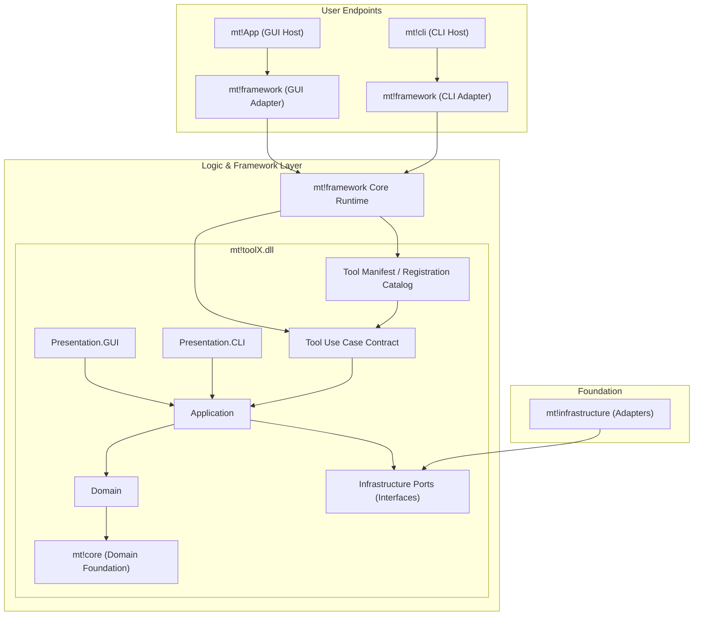

# Context Map

## Target Architecture (Reference)

## Current-to-Target Mapping

This mapping is based on the current `Mapping_Tools` project content.

### `mt!core` (Domain Foundation)
Candidate ownership:
- osu! Stable/Lazer beatmap file contracts and serialization boundaries.
- Beatmap domain objects and invariants (`Classes/BeatmapHelper`).
- Shared base manipulation operations reusable by any tool.
- Timing/snap calculations and math primitives (`Classes/BeatmapHelper/Timing*`, `Classes/MathUtil`).
- Shared cross-tool value objects and policies.

### `mt!infrastructure`
Candidate ownership:
- File system and host integration adapters.
- Settings persistence.
- osu! editor/memory readers.
- Updater and external integrations.
- Implementations of interfaces requested by application services.

### `mt!framework`
Candidate ownership:
- Explicit tool registration/manifest loading.
- Runtime loading of separate tool assemblies.
- Unified use-case invocation contracts.
- Runtime orchestration for GUI host (`mt!App`) and CLI host (`mt!cli`).
- Interface-first boundary between tool modules and the outside world.

### `mt!toolX.dll`
Per tool module split:
- `Domain`: advanced algorithms and manipulation operations specific to a tool.
- `Application`: use cases over tool domain + shared core domain.
- `Presentation.GUI`: optional GUI adapter surfaced by `mt!App`.
- `Presentation.CLI`: optional CLI adapter surfaced by `mt!cli`.

Tools are independent runtime-loadable assemblies and do not couple directly to app hosts.

## Bounded Contexts

1. **Beatmap Composition Context**
   - Language around beatmap structure, objects, storyboard, and metadata sections.
2. **Timing & Rhythm Context**
   - Language around beat snapping, divisors, tempo signatures, and timing points.
3. **Hitsound Context**
   - Language around samples, layers, sample sets, and sound playback semantics.
4. **Map Maintenance Context**
   - Language around cleaning, normalization, consistency repair, and cleanup policies.
5. **Tool Runtime Context**
   - Language around tool registration, execution mode, input/output contracts.

## Relationship Map

- Beatmap Composition depends on Timing & Rhythm and Hitsound for derived behavior.
- Map Maintenance consumes Beatmap Composition + Timing & Rhythm + Hitsound.
- Tool Runtime orchestrates application services from each context.
- Infrastructure provides adapters to all contexts without becoming part of domain language.
- `mt!core` provides shared domain objects and base operations to all tools.
- Tool modules provide advanced operations and expose them through framework contracts.
- `mt!App` and `mt!cli` are host shells; framework controls tool surfacing.

## Context Ownership Rule

When terms overlap:
- Beatmap file shape belongs to Beatmap Composition.
- Time math and snapping belong to Timing & Rhythm.
- Sample identity and playback selection belong to Hitsound.
- “Fix/Clean/Normalize” operations belong to Map Maintenance.
- Execution mode and registration belong to Tool Runtime.

## Extensibility Principle

- New capabilities are added as new tool assemblies when possible.
- Logic moves to `mt!core` only when truly shared by multiple tools.
- External interaction flows through framework contracts and infrastructure ports.
