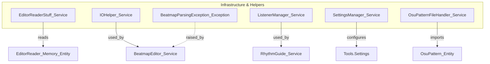

[Memory Bank: Active]
# Context + Domain Map

Purpose
This document enumerates discovered domain objects (aggregates, entities, value objects, repositories, domain services and DTOs) under `Mapping_Tools/Classes/` and groups them by bounded context. It provides a concise, navigable mermaid-based diagram showing ownership, persistence and cross-context relationships to support DDD refactoring and repository extraction.

```mermaid
%% mermaid
graph TD
  %% Shared Kernel / Core domain & persistence
  subgraph Shared_Kernel [Shared Kernel — Core domain & persistence]
    Beatmap_Aggregate[Beatmap_Aggregate]
    HitObject_Entity[HitObject_Entity]
    Timing_Aggregate[Timing_Aggregate]
    TimingPoint_Entity[TimingPoint_Entity]
    TempoSignature_VO[TempoSignature_VO]
    BeatmapEditor_Service[BeatmapEditor_Service]
    BeatmapRepository_Repository[BeatmapRepository_Repository]
    BackupManager_Service[BackupManager_Service]
    ProjectManager_Service[ProjectManager_Service]
  end

  %% Editor integration context (anti-corruption / adaptor)
  subgraph EditorIntegration [EditorReader / Editor Integration]
    EditorReader_Memory_Entity[EditorReader.Memory_Entity]
    EditorReader_Service[EditorReader_Service]
    EditorReaderAdapter_Service[EditorReaderAdapter_Service]
  end

  %% PatternGallery context
  subgraph PatternGallery [PatternGallery]
    PatternGallery_Aggregate[PatternGallery_Aggregate]
    OsuPattern_Entity[OsuPattern_Entity]
    OsuPatternFileHandler_Service[OsuPatternFileHandler_Service]
    OsuPatternMaker_Service[OsuPatternMaker_Service]
    PatternRepository_Repository[PatternRepository_Repository]
    PatternProject_Entity[PatternProject_Entity]
    OsuPatternPlacer_Service[OsuPatternPlacer_Service]
  end

  %% Sliderator context
  subgraph Sliderator [Sliderator]
    Sliderator_Aggregate[Sliderator_Aggregate]
    Slider_Entity[Slider_Entity]
    SliderPath_VO[SliderPath_ValueObject]
    PositionFunction_ValueObject[PositionFunction_ValueObject]
    SliderGenerator_Service[SliderGenerator_Service]
    SliderPicturator_Service[SliderPicturator_Service]
    SliderRepository_Repository[SliderRepository_Repository]
    SliderInvisiblator_Service[SliderInvisiblator_Service]
  end

  %% SnappingTools / Geometry Dashboard context
  subgraph SnappingTools [SnappingTools]
    SnappingProject_Entity[SnappingProject_Entity]
    RelevantObject_Entity[RelevantObject_Entity]
    RelevantHitObject_Entity[RelevantHitObject_Entity]
    RelevantPoint_Entity[RelevantPoint_Entity]
    RelevantLine_Entity[RelevantLine_Entity]
    RelevantObjectsGenerator_Service[RelevantObjectsGenerator_Service]
    GeneratorSettings_Entity[GeneratorSettings_Entity]
    SnappingToolsPreferences_ValueObject[SnappingToolsPreferences_VO]
  end

  %% MapCleaner context
  subgraph MapCleaner [MapCleaner]
    MapCleaner_Service[MapCleaner_Service]
    MapCleanerArgs_ValueObject[MapCleanerArgs_ValueObject]
    MapCleanerResult_ValueObject[MapCleanerResult_ValueObject]
  end

  %% HitsoundStudio context
  subgraph HitsoundStudio [HitsoundStudio]
    HitsoundLayer_Entity[HitsoundLayer_Entity]
    Sample_Entity[Sample_Entity]
    CompleteHitsounds_ValueObject[CompleteHitsounds_VO]
    HitsoundConverter_Service[HitsoundConverter_Service]
    HitsoundExporter_Service[HitsoundExporter_Service]
    HitsoundImporter_Service[HitsoundImporter_Service]
  end

  %% Timing Suite context
  subgraph TimingSuite [TimingSuite]
    TimingUtility_Service[TimingUtility_Service]
    TimingRepository_Repository[TimingRepository_Repository]
    TempoSignature_ValueObject[TempoSignature_ValueObject]
  end

  %% PropertyTransformer context
  subgraph PropertyTransformer [PropertyTransformer]
    PropertyTransformer_Service[PropertyTransformer_Service]
    GraphStateValueGetter_Service[GraphStateValueGetter_Service]
    GraphValue_ValueObject[GraphValue_ValueObject]
  end

  %% ComboColourStudio context
  subgraph ComboColourStudio [ComboColourStudio]
    ColourPoint_Entity[ColourPoint_Entity]
    ComboColourProject_Entity[ComboColourProject_Entity]
    SpecialColour_ValueObject[SpecialColour_VO]
  end

  %% TumourGenerator context
  subgraph TumourGenerator [TumourGenerator]
    TumourGenerator_Service[TumourGenerator_Service]
    TumourTemplate_ValueObject[TumourTemplate_ValueObject]
    ITumourAssignment_Interface[ITumourAssignment_Interface]
  end

  %% RhythmGuide context
  subgraph RhythmGuide [RhythmGuide]
    RhythmGuide_Service[RhythmGuide_Service]
    RhythmAnalysis_Result[RhythmAnalysis_Result]
  end

  %% MetadataManager context
  subgraph MetadataManager [MetadataManager]
    Metadata_Service[Metadata_Service]
    MetadataProject_Entity[MetadataProject_Entity]
  end

  %% Intra-context relationships (ownership / usage)
  PatternGallery_Aggregate -->|owns| OsuPattern_Entity
  PatternGallery_Aggregate -->|persists_in| PatternRepository_Repository
  PatternGallery_Aggregate -->|uses| OsuPatternMaker_Service
  OsuPatternPlacer_Service -->|inserts_into| Beatmap_Aggregate

  Sliderator_Aggregate -->|owns| Slider_Entity
  SliderGenerator_Service -->|creates| Slider_Entity
  Sliderator_Aggregate -->|uses| SliderPath_VO
  SliderGenerator_Service -->|uses| PositionFunction_ValueObject
  SliderPicturator_Service -->|creates| Slider_Entity

  SnappingProject_Entity -->|contains| RelevantObject_Entity
  RelevantObjectsGenerator_Service -->|generates| RelevantObject_Entity
  GeneratorSettings_Entity -->|configures| RelevantObjectsGenerator_Service

  MapCleaner_Service -->|modifies| Beatmap_Aggregate
  MapCleaner_Service -->|consumes| MapCleanerArgs_ValueObject
  MapCleaner_Service -->|produces| MapCleanerResult_ValueObject

  HitsoundConverter_Service -->|references| Beatmap_Aggregate
  HitsoundConverter_Service -->|produces| CompleteHitsounds_ValueObject
  HitsoundExporter_Service -->|persists| Sample_Entity

  Timing_Aggregate -->|contains| TimingPoint_Entity
  TimingRepository_Repository -->|persisted_in| Shared_Storage[SharedStorage]

  PropertyTransformer_Service -->|applies_to| Beatmap_Aggregate
  GraphStateValueGetter_Service -->|reads| GraphValue_ValueObject

  ComboColourProject_Entity -->|applies_to| Beatmap_Aggregate

  TumourGenerator_Service -->|generates| Slider_Entity
  TumourGenerator_Service -->|consumes| TumourTemplate_ValueObject

  RhythmGuide_Service -->|analyzes| Beatmap_Aggregate
  Metadata_Service -->|updates| Beatmap_Aggregate

  %% Cross-context relationships and strategic mappings
  EditorReader_Memory_Entity -->|conformist| Beatmap_Aggregate
  EditorReader_Service -->|provides| EditorReader_Memory_Entity
  EditorReaderAdapter_Service -->|adapts| BeatmapEditor_Service

  BeatmapEditor_Service -->|persists_in| BeatmapRepository_Repository
  BackupManager_Service -->|supplier| Beatmap_Aggregate
  ProjectManager_Service -->|manages| PatternProject_Entity

  PatternRepository_Repository -->|persisted_in| Shared_Storage
  SliderRepository_Repository -->|persisted_in| Shared_Storage
  TimingRepository_Repository -->|persisted_in| Shared_Storage
  PatternGallery_Aggregate -->|references| BeatmapRepository_Repository
  SliderGenerator_Service -->|references| BeatmapRepository_Repository

  %% Shared kernel affiliations
  Timing_Aggregate -->|shared_kernel| Beatmap_Aggregate
  HitObject_Entity -->|has| TimingPoint_Entity

  %% Events (informational)
  SliderGenerated_Event -.->|notifies| PatternGallery_Aggregate
  Backup_Created_Event -.->|notifies| ProjectManager_Service

```

Legend
- Node suffixes:
  - _Aggregate = Aggregate Root
  - _Entity = Entity
  - _VO / _ValueObject = Value Object
  - _Repo / _Repository = Repository / persistence interface
  - _Service = Domain/Application/Adapter service
  - _Interface = Domain interface contract
- Edge labels:
  - owns / stores / manages = aggregate ownership
  - references = runtime reference or read-only dependency
  - persisted_in / persists_in = persistence relation (repository / storage)
  - conformist / shared_kernel / supplier = DDD context mapping semantics
  - uses / creates / generates / produces / modifies / applies_to = behaviour or transformation
  - adapts = anti-corruption / adapter relationship
  - events dashed = domain events or notifications

Assumptions and Inferred Objects
- The following names were inferred from code artifacts under `Mapping_Tools/Classes/` where explicit domain interfaces or DDD annotations were not present. Each entry lists source path(s) and the reason for inclusion:
  - Beatmap_Aggregate — inferred from [`Mapping_Tools/Classes/BeatmapHelper/Beatmap.cs`](Mapping_Tools/Classes/BeatmapHelper/Beatmap.cs:1) and used throughout tools; treated as the primary aggregate for beatmap editing.
  - HitObject_Entity — from [`Mapping_Tools/Classes/BeatmapHelper/HitObject.cs`](Mapping_Tools/Classes/BeatmapHelper/HitObject.cs:1); included as entity inside Beatmap aggregate.
  - Timing_Aggregate / TimingPoint_Entity / TempoSignature_VO — from [`Mapping_Tools/Classes/BeatmapHelper/Timing.cs`](Mapping_Tools/Classes/BeatmapHelper/Timing.cs:1) and [`Mapping_Tools/Classes/BeatmapHelper/TimingPoint.cs`](Mapping_Tools/Classes/BeatmapHelper/TimingPoint.cs:1); treated as timing domain.
  - BeatmapEditor_Service / BeatmapRepository_Repository — inferred from [`Mapping_Tools/Classes/BeatmapHelper/BeatmapEditor.cs`](Mapping_Tools/Classes/BeatmapHelper/BeatmapEditor.cs:1) which centralizes file I/O and serialization; repository interface is inferred for refactoring.
  - BackupManager_Service — from [`Mapping_Tools/Classes/SystemTools/BackupManager.cs`](Mapping_Tools/Classes/SystemTools/BackupManager.cs:1); treated as domain service for transactional backups.
  - EditorReader_Memory_Entity / EditorReader_Service / EditorReaderStuff_Service / EditorReaderAdapter_Service — from [`Mapping_Tools/Classes/ToolHelpers/EditorReaderStuff.cs`](Mapping_Tools/Classes/ToolHelpers/EditorReaderStuff.cs:1) and `lib/EditorReader.dll`; modelled as anti-corruption adapter and memory snapshot entity.
  - PatternGallery_Aggregate, OsuPattern_Entity, OsuPatternFileHandler_Service, OsuPatternMaker_Service, OsuPatternPlacer_Service, PatternRepository_Repository, PatternProject_Entity — from files under [`Mapping_Tools/Classes/Tools/PatternGallery/`](Mapping_Tools/Classes/Tools/PatternGallery/:1) such as `OsuPattern.cs`, `OsuPatternFileHandler.cs`, `OsuPatternMaker.cs`, `OsuPatternPlacer.cs`. Treated as aggregate + supporting services.
  - Sliderator_Aggregate, Slider_Entity, SliderGenerator_Service, SliderRepository_Repository, SliderPicturator_Service, SliderInvisiblator_Service, SliderPath_VO, PositionFunction_ValueObject — from [`Mapping_Tools/Classes/Tools/SlideratorStuff/`](Mapping_Tools/Classes/Tools/SlideratorStuff/:1) and `Sliderator.cs`, `SliderPicturator.cs`.
  - SnappingProject_Entity, RelevantObject_Entity, RelevantHitObject_Entity, RelevantPoint_Entity, RelevantLine_Entity, RelevantObjectsGenerator_Service, GeneratorSettings_Entity — from [`Mapping_Tools/Classes/Tools/SnappingTools/`](Mapping_Tools/Classes/Tools/SnappingTools/:1) (many generator classes and serialization classes). Treated as domain model for geometry tools.
  - MapCleaner_Service, MapCleanerArgs_ValueObject, MapCleanerResult_ValueObject — from [`Mapping_Tools/Classes/Tools/MapCleanerStuff/MapCleaner.cs`](Mapping_Tools/Classes/Tools/MapCleanerStuff/MapCleaner.cs:1) and supporting classes.
  - HitsoundLayer_Entity, Sample_Entity, CompleteHitsounds_VO, HitsoundConverter_Service, HitsoundExporter_Service, HitsoundImporter_Service — from [`Mapping_Tools/Classes/HitsoundStuff/`](Mapping_Tools/Classes/HitsoundStuff/:1).
  - ComboColourProject_Entity, ColourPoint_Entity, SpecialColour_ValueObject — from [`Mapping_Tools/Classes/BeatmapHelper/ComboColour.cs`](Mapping_Tools/Classes/BeatmapHelper/ComboColour.cs:1) and `Tools/ComboColourStudio/`.
  - TumourGenerator_Service, TumourTemplate_ValueObject, ITumourAssignment_Interface — from [`Mapping_Tools/Classes/Tools/TumourGenerating/`](Mapping_Tools/Classes/Tools/TumourGenerating/:1).
  - PropertyTransformer_Service, GraphStateValueGetter_Service, GraphValue_ValueObject — from [`Mapping_Tools/Classes/Tools/SlideratorStuff/GraphStateValueGetter.cs`](Mapping_Tools/Classes/Tools/SlideratorStuff/GraphStateValueGetter.cs:1) and PropertyTransformer viewmodel / services.
  - Metadata_Service, MetadataProject_Entity — from [`Mapping_Tools/Classes/Views/MetadataManager`](Mapping_Tools/Classes/:1) and `Mapping_Tools/Classes/SystemTools/ProjectManager.cs` interactions.
  - TimingRepository_Repository, PatternRepository_Repository, SliderRepository_Repository — repository interfaces inferred from persistence responsibilities across tools (e.g., BeatmapEditor).

Notes on inference
- Files under `Mapping_Tools/Classes/MathUtil`, `JsonConverters`, and most `Components` are considered technical/value helpers and grouped under Helpers rather than explicit domain nodes, unless they surface as a clear domain concept (e.g., `ComboColour`, `Timing`).
- Class names used as nodes follow a conservative mapping: concrete classes that clearly represent domain concepts are named as Entities/Aggregates; service-like classes (EditorReaderStuff, BackupManager, BeatmapEditor) are modelled as _Service nodes; persistence and repository responsibilities are modelled as _Repository nodes when behaviour implies durable storage.
- Source of canonical bounded context names: existing context detail files under [`docs/ddd/`](docs/ddd/:1) and the repository structure (Tools/* subfolders).

Related links
- [`README.md`](docs/ddd/README.md:1)
- Pattern/context details: [`Context_Details_PatternGallery.md`](docs/ddd/Context_Details_PatternGallery.md:1), [`Context_Details_Sliderator.md`](docs/ddd/Context_Details_Sliderator.md:1), [`Context_Details_SnappingTools.md`](docs/ddd/Context_Details_SnappingTools.md:1)