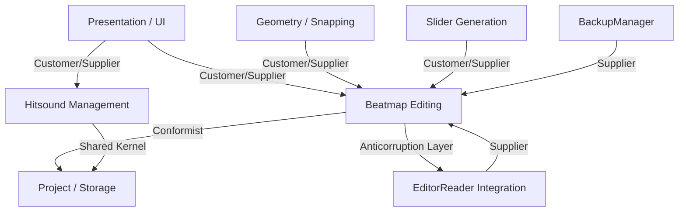

# Context Map

The context map below shows inferred bounded contexts for Mapping Tools and their relationships. Names are taken from the project's memory bank and inferred bounded contexts where a dedicated file was not present.

Assumptions
- Bounded context names were inferred from memory-bank files (`brief.md`, `architecture.md`, `product.md`) where `bounded-contexts.md` was not present.
- `EditorReader Integration` and `BackupManager` are shown as external/system contexts rather than full bounded contexts.
- Relationship labels chosen by common DDD patterns inferred from architecture (e.g., BE uses EditorReader via an ACL).
- Use [`README.md`](./docs/ddd/README.md:1) for navigation.