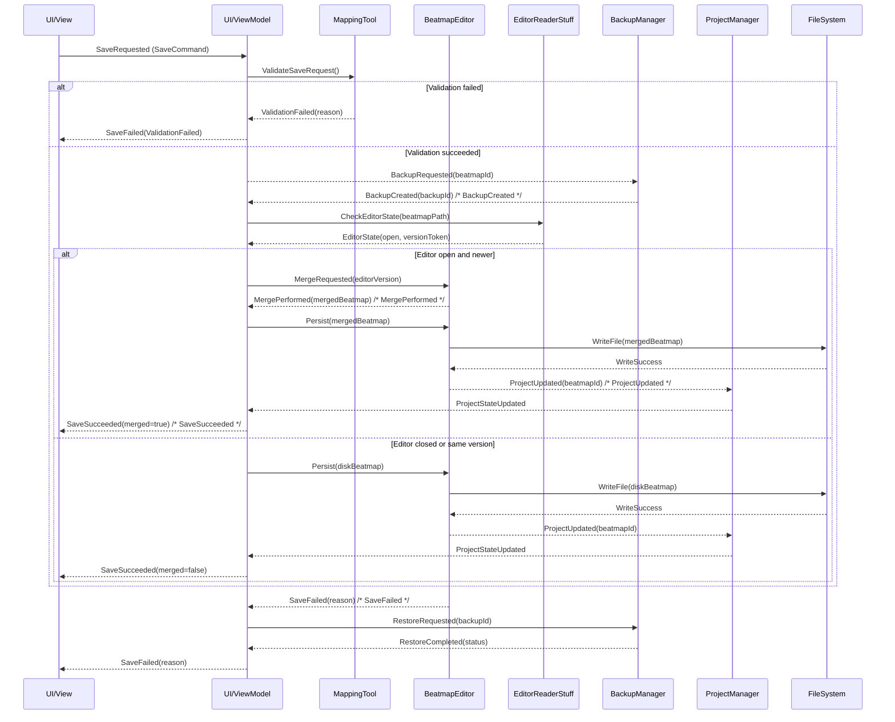

# Critical Flow — Save Beatmap (Apply Changes with Editor Merge)

This document describes the single most important cross-context operation: "Save Beatmap (Apply Changes with Editor Merge)". It explains the coordination between UI, tool ViewModel, BeatmapEditor, EditorReaderStuff, BackupManager, ProjectManager and the file system when saving while the osu! editor may hold a newer in-memory version.

Sequence diagram



Determine Save Strategy flowchart

```mermaid
graph TD
  A[User issues Save] --> B{Is map open in editor?}
  B -- Yes --> C{Is merge required?}
  B -- No --> I[Save to disk only]
  C -- Yes --> D[Create backup]
  C -- No --> I
  D --> E{Backup successful?}
  E -- Yes --> F[Perform Merge and Save] 
  E -- No --> H[Abort + Notify]
  F --> G[Write merged file to disk]
  G --> J[SaveSucceeded (merged=true)]
  I --> K[Write disk version to disk]
  K --> L[SaveSucceeded (merged=false)]
  G -- fail --> M[SaveFailed]
  K -- fail --> M
  M --> N[Rollback from Backup]
  N --> O[Notify user + Offer restore]
```

Notes
- Domain events used: SaveRequested, BackupCreated, MergePerformed, SaveSucceeded, SaveFailed, ProjectUpdated.
- Anti-Corruption Layer: EditorReaderStuff should expose a minimal contract (GetNewestVersionOrNot) to keep domain logic isolated.
- Related: [`1_Context_Map.md`](./docs/ddd/1_Context_Map.md:1)