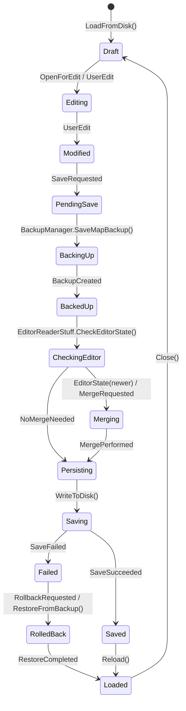

# State Model — Aggregate Root: Beatmap

Choice
- Aggregate Root: Beatmap (chosen as the primary, most complex aggregate; it coordinates hit objects, timing points, samples, and persistence/merge operations).

Assumptions
- The domain exposes a VersionToken on Beatmap used to compare editor in-memory state vs disk; this is inferred from GetNewestVersionOrNot and merge flows.
- Backup metadata (backupId, createdAt) is managed by BackupManager and referenced by the Beatmap aggregate during rollback.

Responsibilities & invariants
- The Beatmap aggregate is responsible for holding the canonical in-memory representation of a .osu file (hit objects, timing points, metadata, sample references), validating edits, and coordinating save workflows (backup → optional merge → persist).
- Invariants: a backup must exist before any destructive write; versionToken must be used to prevent silent overwrites; timing lists must remain sorted for binary-search invariants.

State diagram

Notes on guards and invariants
- Guard: transition from BackingUp to BackedUp requires BackupCreated == true; failing backup aborts save (Abort + Notify).
- Guard: Merging only executes if EditorReader reports an editor-open state with a higher VersionToken; otherwise Persisting uses disk beatmap.
- Invariant: Timing point collections must remain sorted after merge to preserve Timing.GetRedlineAtTime() binary-search guarantees.
- Domain service boundaries: EditorReaderStuff is treated as an anti-corruption adapter returning a simple EditorState; BackupManager is a domain service invoked by the aggregate during PendingSave.