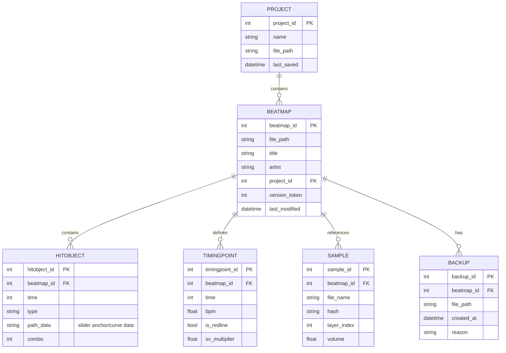

# Data Schema — Core Domain Tables

The diagram models core domain tables inferred from the memory bank and code structure: Beatmap, HitObject, TimingPoint, Sample, Project and Backup.

## Assumptions
- Attribute names use snake_case identifiers to make PK/FK roles explicit; this is an inferred mapping to a relational schema.
- Version comparison uses a numeric version_token on Beatmap (inferred from GetNewestVersionOrNot) to drive merge decisions.
- Backup is modelled as a first-class entity (backup_id, created_at) referenced by BackupManager.

## Mapping notes
- Beatmap (beatmap_id) is the aggregate root coordinating HitObject, TimingPoint, Sample and Backup entities.
- HitObject and TimingPoint are strongly owned by Beatmap; their lifecycle follows Beatmap persistence operations.
- Backup entries are created before destructive saves and retained until save completes or cleanup runs.
- Project groups beatmaps and stores per-tool project state (ISavable), patterns and project-level configuration.

Related docs: [`1_Context_Map.md`](./docs/ddd/1_Context_Map.md:1) — [`2_Ubiquitous_Language.md`](./docs/ddd/2_Ubiquitous_Language.md:1)