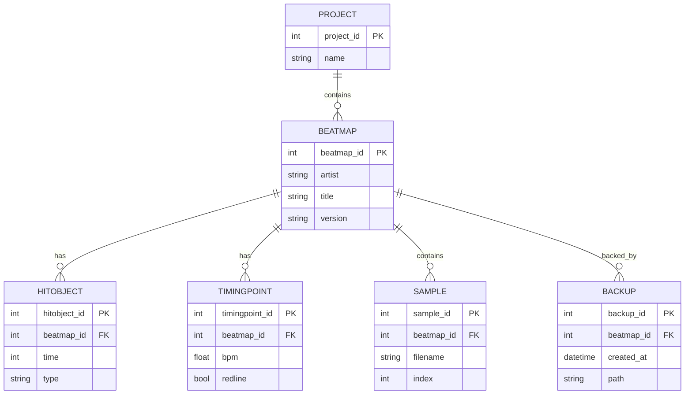
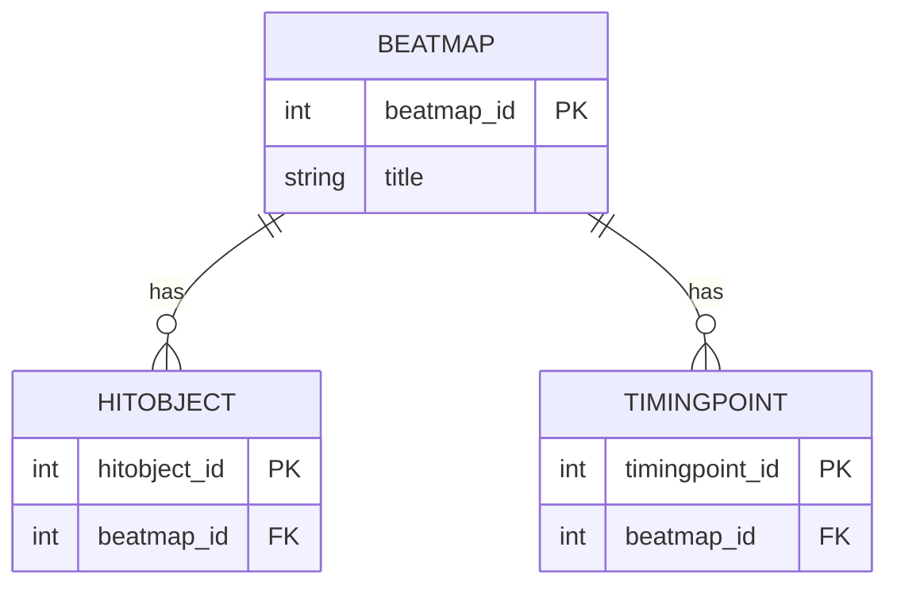
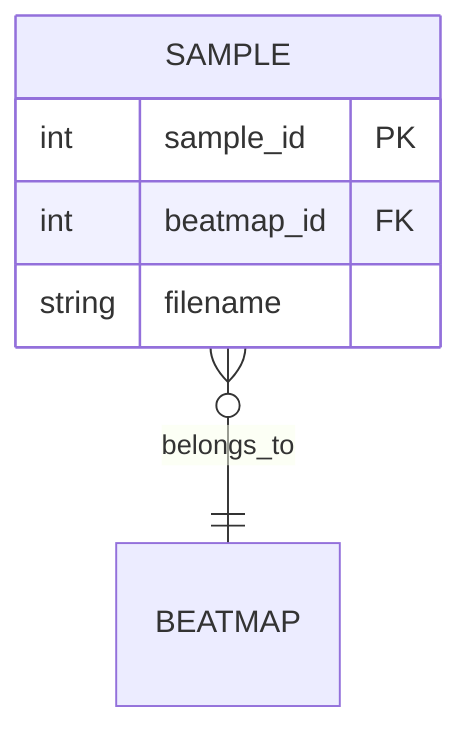
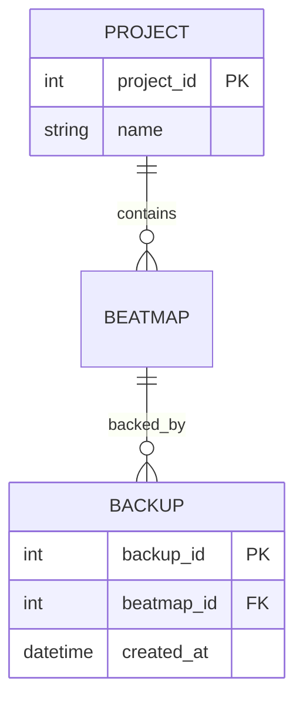
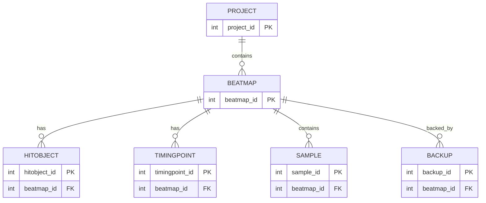

# Data Schema — Core ERD

Purpose: Provide a concise, implementation-focused ER view of core domain persistence. The diagrams show primary tables for the core domain and how they relate across bounded contexts.

## Core ER Diagram

## Grouped ERD (by Bounded Contexts)

Beatmap Core context

Hitsound Studio context

Tools / Project & Backup context

## Combined Cross-Context ERD

## Legend

- PK: Primary key. FK: Foreign key.
- Relationship labels:
  - has — aggregation (one-to-many within aggregate)
  - contains — composition or ownership
  - backed_by — backup / supplier relation
  - belongs_to — cross-context reference

## Assumptions

- PROJECT and BACKUP inferred from Memory Bank and BackupManager usage (Mapping_Tools/Classes/SystemTools/BackupManager.cs) — represent persistent project grouping and backup records for rollback/restore.
- SAMPLE inferred from Hitsound modules (Mapping_Tools/Classes/HitsoundStuff/) — represents persisted sample metadata referenced by Beatmap.
- TIMINGPOINT and HITOBJECT map directly to classes in Mapping_Tools/Classes/BeatmapHelper/ and are modeled as persisted entities owned by the Beatmap aggregate.
- Additional technical fields (artist, version, path) are illustrative and inferred from product.md and Beatmap.cs structure for clarity in ER diagrams.

## Mapping Notes

- Beatmap aggregate persists BEATMAP, HITOBJECT, TIMINGPOINT, and SAMPLE via BeatmapRepository; repository interfaces should align with these tables.
- BackupManager is a domain service that writes BACKUP records before destructive operations; consider transaction/compensating action patterns for rollback.
- PROJECT groups BEATMAPs for multi-difficulty mapset operations and can be the unit for exports and bulk operations.
