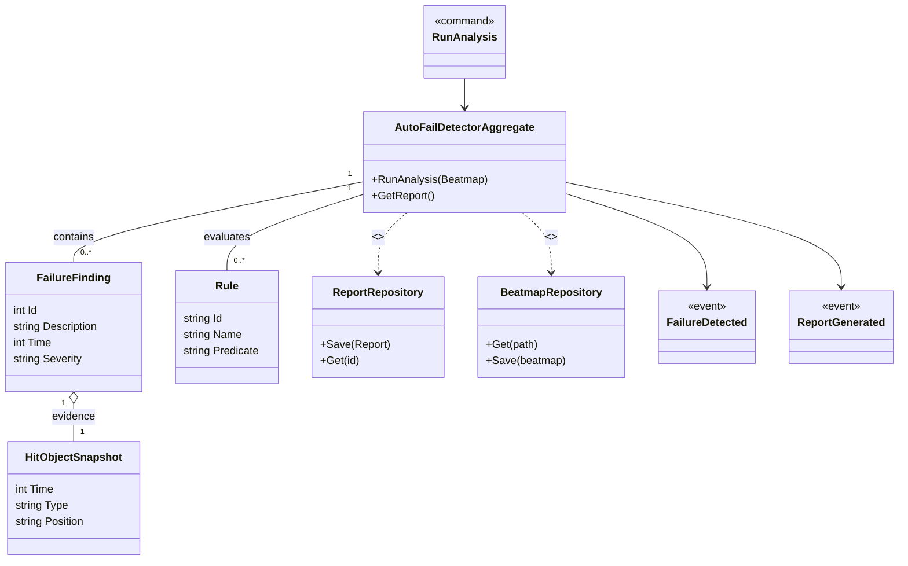

# Context Details — AutoFailDetector

Purpose
The AutoFailDetector tool analyses a beatmap to detect patterns that would cause automatic failure or are structurally invalid (e.g., unreachable sequences, impossible timings). It is a QA/analysis tool used by mappers to flag issues before saving or publishing.

Assumptions
- There is no explicit AutoFail domain class in memory bank; the aggregate and entities are inferred from tool name and typical analyzer patterns.
- Repository interfaces (BeatmapRepository, ReportRepository) are inferred and should map to existing BeatmapEditor / ProjectManager responsibilities.
- Events (FailureDetected, ReportGenerated) are inferred to support UI updates and background processing notifications.

Related links
- [`README.md`](./docs/ddd/README.md:1)
- [`Context_Details_MapCleaner.md`](./docs/ddd/Context_Details_MapCleaner.md:1) — related cleanup tooling