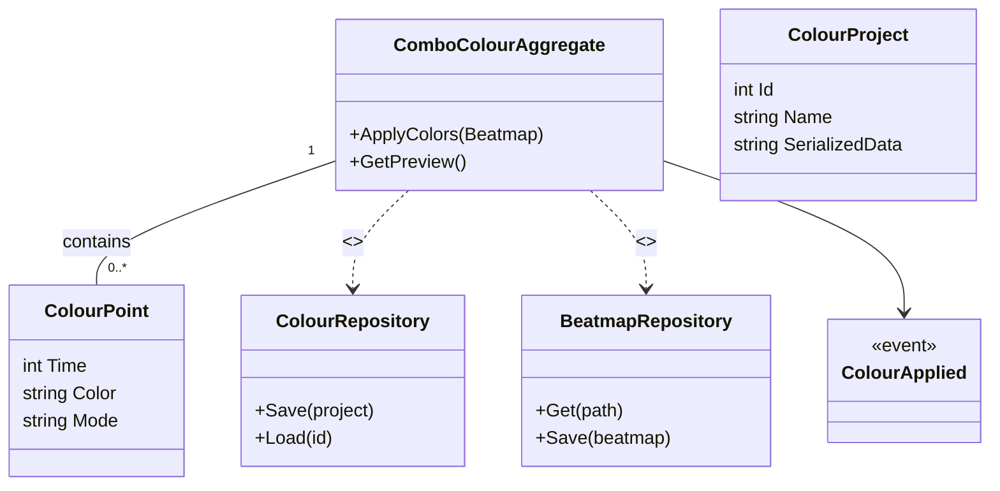

# Context Details — ComboColourStudio

Purpose
ComboColourStudio manages timeline-based combo color assignment and interpolation for a beatmap. It allows mappers to design combo color transitions across time, preview colors, and export resulting combo color data to the beatmap.

Assumptions
- ColourProject and repository are inferred from files under ComboColourStudio and PatternGallery/Project patterns.
- Events and repository interfaces are inferred to support persistence and UI updates.

Related links
- [`README.md`](./docs/ddd/README.md:1)