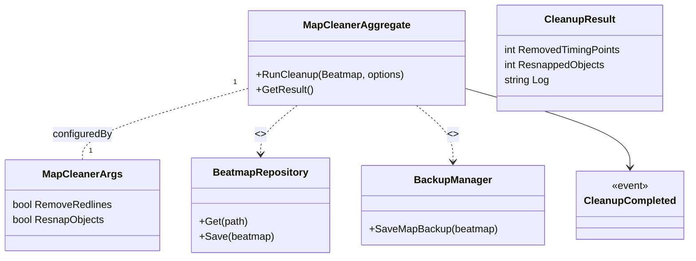

# Context Details — MapCleaner

Purpose
MapCleaner automates beatmap optimization tasks: removing redundant timing points, resnapping objects to timing, and normalizing file structure to reduce bloat and prepare beatmaps for export or ranking.

Assumptions
- MapCleanerArgs and CleanupResult classes are present in code (`MapCleanerStuff/MapCleanerArgs.cs`, `MapCleanerResult.cs`) and mapped to aggregate behavior.
- MapCleaner uses BeatmapRepository / BeatmapEditor for file operations and BackupManager for safe writes.
- Events and repositories are inferred for integration and UI notifications.

Related links
- [`README.md`](./docs/ddd/README.md:1)
- [`Context_Details_AutoFailDetector.md`](./docs/ddd/Context_Details_AutoFailDetector.md:1)