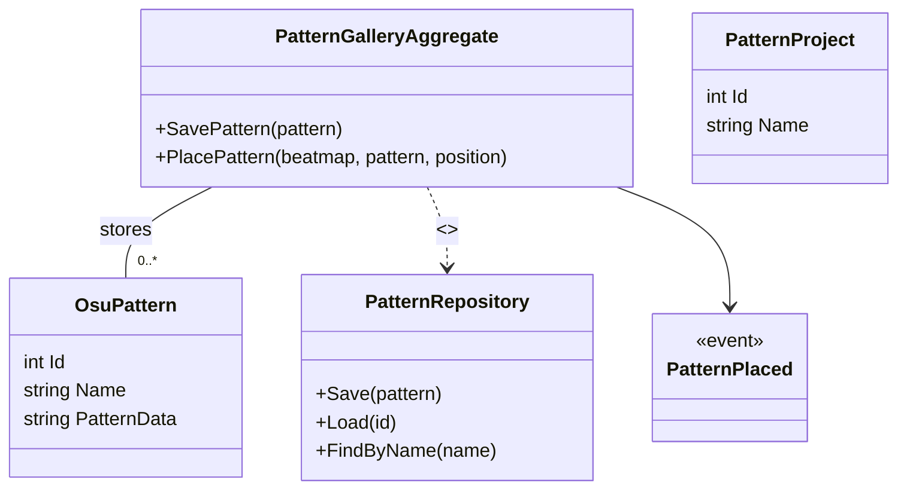

# Context Details — PatternGallery

Purpose
PatternGallery stores, manages and inserts reusable mapping patterns (OsuPattern). It enables export/import, grouping and quick placement of user-defined patterns into beatmaps.

Assumptions
- OsuPattern and file handlers exist under PatternGallery code; repository interfaces are inferred for persistence.
- Pattern placement interacts with BeatmapRepository/BeatmapEditor for writes.

Related links
- [`README.md`](./docs/ddd/README.md:1)
- [`Context_Details_Sliderator.md`](./docs/ddd/Context_Details_Sliderator.md:1)