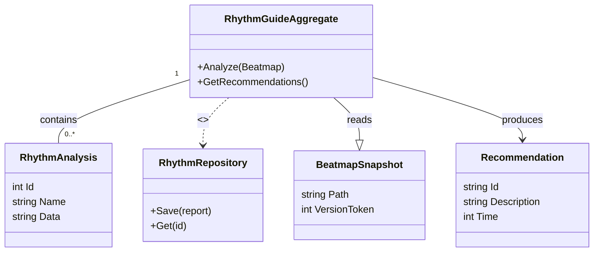

# Context Details — RhythmGuide

Purpose
RhythmGuide analyses beatmap timing and object density to surface rhythmical opportunities, detect weak spots, and suggest pattern placements. It provides visual analysis and recommendations to the mapper to improve musical alignment and pattern variety.

Assumptions
- The RhythmGuide aggregate and repository are inferred (no explicit domain file); analysis artifacts map to test/resources and VM reports.
- BeatmapSnapshot represents the Beatmap aggregate read via BeatmapEditor/EditorReader.
- Recommendations are lightweight DTOs used by UI; persistence is optional and therefore a RhythmRepository is inferred.

Related links
- [`README.md`](./docs/ddd/README.md:1)
- [`Context_Details_PatternGallery.md`](./docs/ddd/Context_Details_PatternGallery.md:1)