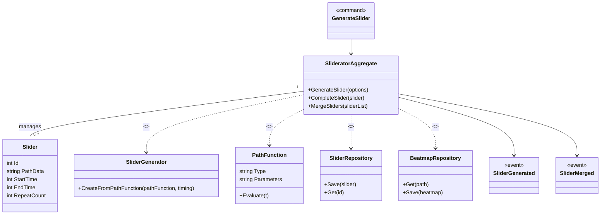

# Context Details — Sliderator

Purpose
Sliderator and its companion tools (SliderCompletionator, SliderMerger, SliderPicturator) generate and manipulate slider hit objects using mathematical curves and path functions. They are used to create, transform and batch-generate sliders (anchor points, curve interpolation, invisibility flags) for beatmap editing and composition.

Assumptions
- The code under `SlideratorStuff/` (e.g., `Sliderator.cs`, `SliderPicturator.cs`) represents a single logical bounded context for slider generation; individual classes are collapsed into the aggregate for clarity.
- Repository interfaces (SliderRepository, BeatmapRepository) are inferred and should map to existing BeatmapEditor responsibilities.
- Events and commands are inferred to support UI and background worker orchestration (BackgroundWorker_DoWork).
- PathFunction represents mathematical generators such as Bezier/BezierCubic and position delegates found under `MathUtil/` and `SlideratorStuff/`.

Related links
- [`README.md`](./docs/ddd/README.md:1)
- [`Context_Details_PatternGallery.md`](./docs/ddd/Context_Details_PatternGallery.md:1)