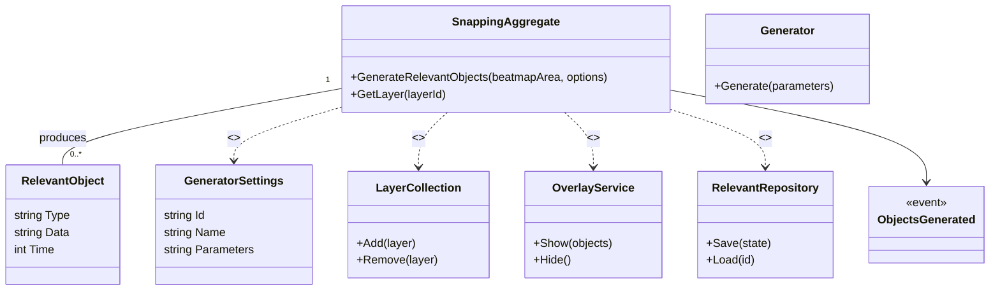

# Context Details — SnappingTools

Purpose
SnappingTools provides geometric generators and an in-game overlay to help place objects precisely using constructions like intersections, parallels, bisectors and slider path generators. It is a geometry-focused bounded context that supplies relevant objects to the Beatmap Editing context.

Assumptions
- SnappingTools contains many generator implementations under `SnappingTools/DataStructure/RelevantObjectGenerators/Generators/`; they are represented as a generic Generator type inside the aggregate.
- Persistent project state (SnappingToolsProject) and preferences map to RelevantRepository and GeneratorSettings.
- OverlayService denotes in-game overlay integration using Overlay.NET.

Related links
- [`README.md`](./docs/ddd/README.md:1)
- [`Context_Details_Sliderator.md`](./docs/ddd/Context_Details_Sliderator.md:1)