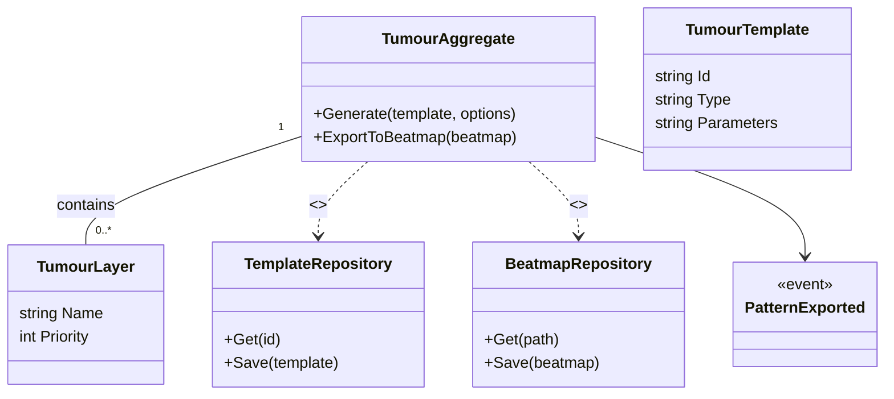

# Context Details — TumourGenerator

Purpose
TumourGenerator is an algorithmic pattern generator that creates complex, repeatable structures (tumour patterns) using template-based generators (circle, parabola, square, triangle). It is used for creative pattern creation and can output patterns into beatmaps as sequences of HitObjects.

Assumptions
- Tumour templates and layers exist under `TumourGenerating/Options/TumourTemplates/`; repository abstraction is inferred for reuse and persistence.
- Export mechanics use BeatmapRepository/BeatmapEditor for writing into beatmaps.

Related links
- [`README.md`](./docs/ddd/README.md:1)
- [`Context_Details_Sliderator.md`](./docs/ddd/Context_Details_Sliderator.md:1)